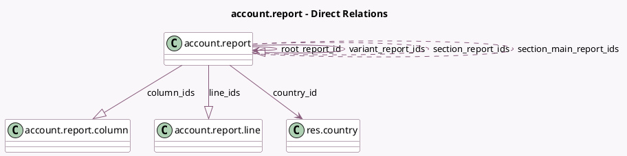

<!-- GENERATED:MODEL -->
---
tags: [odoo, community, generated, model]
---

# account.report

- Module: [[docs/Community Addons/account/account|account]]
- Scope: Community Addons
- Defined in module: yes
- Source files: `models/account_report.py`
- Python classes: `AccountReport`
- Description: Accounting Report

## Field footprint

- Detected fields: 36
- Field types: `Boolean` x 16, `Char` x 1, `Integer` x 3, `Many2many` x 2, `Many2one` x 2, `One2many` x 3, `Selection` x 9
- Relation fields: 7

## Sample fields

- `active`: `Boolean`
- `allow_foreign_vat`: `Boolean` (store `True`)
- `availability_condition`: `Selection` (compute `_compute_default_availability_condition`, store `True`)
- `chart_template`: `Selection`
- `column_ids`: `One2many` (comodel `account.report.column`)
- `country_id`: `Many2one` (comodel `res.country`)
- `currency_translation`: `Selection` (store `True`)
- `default_opening_date_filter`: `Selection` (store `True`)
- `filter_account_type`: `Selection` (store `True`)
- `filter_aml_ir_filters`: `Boolean` (store `True`)
- `filter_analytic`: `Boolean` (store `True`)
- `filter_budgets`: `Boolean` (store `True`)
- `filter_date_range`: `Boolean` (store `True`)
- `filter_growth_comparison`: `Boolean` (store `True`)
- `filter_hide_0_lines`: `Selection` (store `True`)
- `filter_hierarchy`: `Selection` (store `True`)
- `filter_journals`: `Boolean` (store `True`)
- `filter_multi_company`: `Selection` (store `True`)
- `filter_partner`: `Boolean` (store `True`)
- `filter_period_comparison`: `Boolean` (store `True`)

## Method hints

- Detected methods: 14
- Action methods: none
- Compute methods: `_compute_default_availability_condition`, `_compute_display_name`, `_compute_report_option_filter`, `_compute_use_sections`
- Onchange methods: `_onchange_availability_condition`

## Direct relation diagram

## Navigation

- **Parent:** [[docs/Community Addons/account/Models]]

<!-- GENERATED:MODEL -->
