<!-- GENERATED:MODEL -->
---
tags: [odoo, community, generated, model]
---

# account.resequence.wizard

- Module: [[docs/Community Addons/account/account|account]]
- Scope: Community Addons
- Defined in module: yes
- Source files: `wizard/account_resequence.py`
- Python classes: `AccountResequenceWizard`
- Description: Remake the sequence of Journal Entries.

## Field footprint

- Detected fields: 8
- Field types: `Char` x 2, `Date` x 2, `Many2many` x 1, `Selection` x 1, `Text` x 2
- Relation fields: 1

## Sample fields

- `end_date`: `Date`
- `first_date`: `Date`
- `first_name`: `Char` (compute `_compute_first_name`, store `True`)
- `move_ids`: `Many2many` (comodel `account.move`)
- `new_values`: `Text` (compute `_compute_new_values`)
- `ordering`: `Selection`
- `preview_moves`: `Text` (compute `_compute_preview_moves`)
- `sequence_number_reset`: `Char` (compute `_compute_sequence_number_reset`)

## Method hints

- Detected methods: 6
- Action methods: none
- Compute methods: `_compute_first_name`, `_compute_new_values`, `_compute_preview_moves`, `_compute_sequence_number_reset`
- Onchange methods: none

## Direct relation diagram

```plantuml
@startuml
!define ODOO_COLOR_PRIMARY #714B67
!define ODOO_COLOR_ACCENT #875A7B
!define ODOO_COLOR_BG #FAF7FA

skinparam backgroundColor ODOO_COLOR_BG
skinparam defaultTextAlignment left
skinparam ArrowColor ODOO_COLOR_ACCENT
skinparam ClassBackgroundColor white
skinparam ClassBorderColor ODOO_COLOR_PRIMARY
skinparam ComponentBackgroundColor white
skinparam ComponentBorderColor ODOO_COLOR_PRIMARY
skinparam NoteBackgroundColor #FFF8FF
skinparam NoteBorderColor ODOO_COLOR_ACCENT
skinparam SequenceLifeLineBorderColor ODOO_COLOR_ACCENT
skinparam SequenceLifeLineBackgroundColor #FFFFFF
skinparam SequenceParticipantBorderColor ODOO_COLOR_PRIMARY
skinparam SequenceParticipantBackgroundColor #FFFFFF
skinparam sequence {
  ArrowColor ODOO_COLOR_ACCENT
  ActorBorderColor ODOO_COLOR_PRIMARY
}
title account.resequence.wizard - Direct Relations
class "account.resequence.wizard" as account_resequence_wizard
class "account.move" as account_move
account_resequence_wizard .. account_move : move_ids
@enduml
```

## Navigation

- **Parent:** [[docs/Community Addons/account/Models]]

<!-- GENERATED:MODEL -->
