<!-- GENERATED:MODEL -->
---
tags: [odoo, community, generated, model]
---

# account.root

- Module: [[docs/Community Addons/account/account|account]]
- Scope: Community Addons
- Defined in module: yes
- Source files: `models/account_root.py`
- Python classes: `AccountRoot`
- Description: Account codes first 2 digits

## Field footprint

- Detected fields: 2
- Field types: `Char` x 1, `Many2one` x 1
- Relation fields: 1

## Sample fields

- `name`: `Char` (compute `_compute_root`)
- `parent_id`: `Many2one` (comodel `account.root`, compute `_compute_root`)

## Method hints

- Detected methods: 4
- Action methods: none
- Compute methods: `_compute_root`
- Onchange methods: none

## Direct relation diagram

```plantuml
@startuml
!define ODOO_COLOR_PRIMARY #714B67
!define ODOO_COLOR_ACCENT #875A7B
!define ODOO_COLOR_BG #FAF7FA

skinparam backgroundColor ODOO_COLOR_BG
skinparam defaultTextAlignment left
skinparam ArrowColor ODOO_COLOR_ACCENT
skinparam ClassBackgroundColor white
skinparam ClassBorderColor ODOO_COLOR_PRIMARY
skinparam ComponentBackgroundColor white
skinparam ComponentBorderColor ODOO_COLOR_PRIMARY
skinparam NoteBackgroundColor #FFF8FF
skinparam NoteBorderColor ODOO_COLOR_ACCENT
skinparam SequenceLifeLineBorderColor ODOO_COLOR_ACCENT
skinparam SequenceLifeLineBackgroundColor #FFFFFF
skinparam SequenceParticipantBorderColor ODOO_COLOR_PRIMARY
skinparam SequenceParticipantBackgroundColor #FFFFFF
skinparam sequence {
  ArrowColor ODOO_COLOR_ACCENT
  ActorBorderColor ODOO_COLOR_PRIMARY
}
title account.root - Direct Relations
class "account.root" as account_root
class "account.root" as account_root
account_root --> account_root : parent_id
@enduml
```

## Navigation

- **Parent:** [[docs/Community Addons/account/Models]]

<!-- GENERATED:MODEL -->
