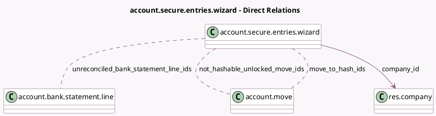

<!-- GENERATED:MODEL -->
---
tags: [odoo, community, generated, model]
---

# account.secure.entries.wizard

- Module: [[docs/Community Addons/account/account|account]]
- Scope: Community Addons
- Defined in module: yes
- Source files: `wizard/account_secure_entries_wizard.py`
- Python classes: `AccountSecureEntriesWizard`
- Description: Secure Journal Entries

## Field footprint

- Detected fields: 9
- Field types: `Char` x 1, `Date` x 2, `Json` x 2, `Many2many` x 3, `Many2one` x 1
- Relation fields: 4

## Sample fields

- `chains_to_hash_with_gaps`: `Json` (compute `_compute_data`)
- `company_id`: `Many2one` (comodel `res.company`)
- `country_code`: `Char` (related `company_id.account_fiscal_country_id.code`)
- `hash_date`: `Date` (compute `_compute_hash_date`, store `True`)
- `max_hash_date`: `Date` (compute `_compute_max_hash_date`)
- `move_to_hash_ids`: `Many2many` (comodel `account.move`, compute `_compute_data`)
- `not_hashable_unlocked_move_ids`: `Many2many` (comodel `account.move`, compute `_compute_data`)
- `unreconciled_bank_statement_line_ids`: `Many2many` (comodel `account.bank.statement.line`, compute `_compute_data`)
- `warnings`: `Json` (compute `_compute_warnings`)

## Method hints

- Detected methods: 10
- Action methods: `action_secure_entries`, `action_show_draft_moves_in_hashed_period`, `action_show_moves`
- Compute methods: `_compute_data`, `_compute_hash_date`, `_compute_max_hash_date`, `_compute_warnings`
- Onchange methods: none

## Direct relation diagram

## Navigation

- **Parent:** [[docs/Community Addons/account/Models]]

<!-- GENERATED:MODEL -->
