<!-- GENERATED:MODEL -->
---
tags: [odoo, community, generated, model]
---

# account.setup.bank.manual.config

- Module: [[docs/Community Addons/account/account|account]]
- Scope: Community Addons
- Defined in module: yes
- Source files: `wizard/setup_wizards.py`
- Python classes: `AccountSetupBankManualConfig`
- Description: Bank setup manual config

## Field footprint

- Detected fields: 7
- Field types: `Char` x 2, `Integer` x 2, `Many2one` x 3
- Relation fields: 3

## Sample fields

- `bank_bic`: `Char` (related `bank_id.bic`)
- `company_id`: `Many2one` (comodel `res.company`, compute `_compute_company_id`)
- `linked_journal_id`: `Many2one` (comodel `account.journal`, compute `_compute_linked_journal_id`)
- `new_journal_name`: `Char`
- `num_journals_without_account_bank`: `Integer`
- `num_journals_without_account_credit`: `Integer`
- `res_partner_bank_id`: `Many2one` (comodel `res.partner.bank`)

## Method hints

- Detected methods: 9
- Action methods: none
- Compute methods: `_compute_company_id`, `_compute_linked_journal_id`
- Onchange methods: `_onchange_acc_number`, `_onchange_new_journal_related_data`

## Direct relation diagram

```plantuml
@startuml
!define ODOO_COLOR_PRIMARY #714B67
!define ODOO_COLOR_ACCENT #875A7B
!define ODOO_COLOR_BG #FAF7FA

skinparam backgroundColor ODOO_COLOR_BG
skinparam defaultTextAlignment left
skinparam ArrowColor ODOO_COLOR_ACCENT
skinparam ClassBackgroundColor white
skinparam ClassBorderColor ODOO_COLOR_PRIMARY
skinparam ComponentBackgroundColor white
skinparam ComponentBorderColor ODOO_COLOR_PRIMARY
skinparam NoteBackgroundColor #FFF8FF
skinparam NoteBorderColor ODOO_COLOR_ACCENT
skinparam SequenceLifeLineBorderColor ODOO_COLOR_ACCENT
skinparam SequenceLifeLineBackgroundColor #FFFFFF
skinparam SequenceParticipantBorderColor ODOO_COLOR_PRIMARY
skinparam SequenceParticipantBackgroundColor #FFFFFF
skinparam sequence {
  ArrowColor ODOO_COLOR_ACCENT
  ActorBorderColor ODOO_COLOR_PRIMARY
}
title account.setup.bank.manual.config - Direct Relations
class "account.setup.bank.manual.config" as account_setup_bank_manual_config
class "account.journal" as account_journal
class "res.company" as res_company
class "res.partner.bank" as res_partner_bank
account_setup_bank_manual_config --> res_partner_bank : res_partner_bank_id
account_setup_bank_manual_config --> account_journal : linked_journal_id
account_setup_bank_manual_config --> res_company : company_id
@enduml
```

## Navigation

- **Parent:** [[docs/Community Addons/account/Models]]

<!-- GENERATED:MODEL -->
