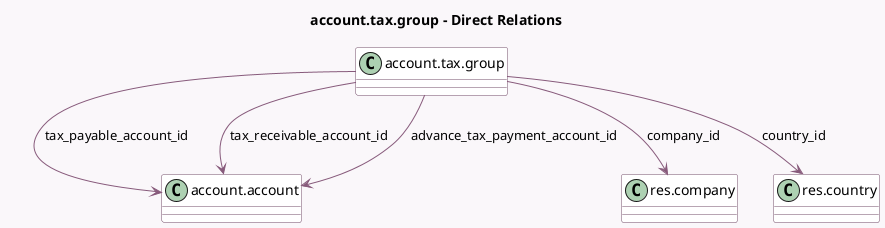

<!-- GENERATED:MODEL -->
---
tags: [odoo, community, generated, model]
---

# account.tax.group

- Module: [[docs/Community Addons/account/account|account]]
- Scope: Community Addons
- Defined in module: yes
- Source files: `models/account_tax.py`
- Python classes: `AccountTaxGroup`
- Description: Tax Group

## Field footprint

- Detected fields: 10
- Field types: `Char` x 4, `Integer` x 1, `Many2one` x 5
- Relation fields: 5

## Sample fields

- `advance_tax_payment_account_id`: `Many2one` (comodel `account.account`)
- `company_id`: `Many2one` (comodel `res.company`)
- `country_code`: `Char` (related `country_id.code`)
- `country_id`: `Many2one` (comodel `res.country`, compute `_compute_country_id`, store `True`)
- `name`: `Char`
- `pos_receipt_label`: `Char`
- `preceding_subtotal`: `Char`
- `sequence`: `Integer`
- `tax_payable_account_id`: `Many2one` (comodel `account.account`)
- `tax_receivable_account_id`: `Many2one` (comodel `account.account`)

## Method hints

- Detected methods: 2
- Action methods: none
- Compute methods: `_compute_country_id`
- Onchange methods: none

## Direct relation diagram

## Navigation

- **Parent:** [[docs/Community Addons/account/Models]]

<!-- GENERATED:MODEL -->
