<!-- GENERATED:MODEL -->
---
tags: [odoo, community, generated, model]
---

# account.tax

- Module: [[docs/Community Addons/account/account|account]]
- Scope: Community Addons
- Defined in module: yes
- Source files: `models/account_tax.py`
- Python classes: `AccountTax`
- Description: Tax
- Inherits: `mail.thread`

## Field footprint

- Detected fields: 36
- Field types: `Boolean` x 10, `Char` x 5, `Float` x 1, `Html` x 2, `Integer` x 1, `Many2many` x 4, `Many2one` x 4, `One2many` x 3, `Selection` x 6
- Relation fields: 11

## Sample fields

- `active`: `Boolean`
- `amount`: `Float`
- `amount_type`: `Selection`
- `analytic`: `Boolean`
- `cash_basis_transition_account_id`: `Many2one` (comodel `account.account`)
- `children_tax_ids`: `Many2many` (comodel `account.tax`)
- `company_id`: `Many2one` (comodel `res.company`)
- `company_price_include`: `Selection` (related `company_id.account_price_include`)
- `country_code`: `Char` (related `country_id.code`)
- `country_id`: `Many2one` (comodel `res.country`, compute `_compute_country_id`, store `True`)
- `description`: `Html`
- `display_alternative_taxes_field`: `Boolean` (compute `_compute_display_alternative_taxes_field`)
- `fiscal_position_ids`: `Many2many` (comodel `account.fiscal.position`)
- `has_negative_factor`: `Boolean` (compute `_compute_has_negative_factor`)
- `hide_tax_exigibility`: `Boolean` (related `company_id.tax_exigibility`)
- `include_base_amount`: `Boolean`
- `invoice_label`: `Char`
- `invoice_legal_notes`: `Html`
- `invoice_repartition_line_ids`: `One2many` (comodel `account.tax.repartition.line`, compute `_compute_invoice_repartition_line_ids`, store `True`)
- `is_base_affected`: `Boolean`

## Method hints

- Detected methods: 88
- Action methods: none
- Compute methods: `_compute_country_id`, `_compute_display_alternative_taxes_field`, `_compute_display_name`, `_compute_has_negative_factor`, `_compute_invoice_repartition_line_ids`, `_compute_is_domestic`, `_compute_is_used`, `_compute_price_include`, and 5 more
- Onchange methods: `onchange_amount`, `onchange_amount_type`, `onchange_price_include`

## Direct relation diagram

```plantuml
@startuml
!define ODOO_COLOR_PRIMARY #714B67
!define ODOO_COLOR_ACCENT #875A7B
!define ODOO_COLOR_BG #FAF7FA

skinparam backgroundColor ODOO_COLOR_BG
skinparam defaultTextAlignment left
skinparam ArrowColor ODOO_COLOR_ACCENT
skinparam ClassBackgroundColor white
skinparam ClassBorderColor ODOO_COLOR_PRIMARY
skinparam ComponentBackgroundColor white
skinparam ComponentBorderColor ODOO_COLOR_PRIMARY
skinparam NoteBackgroundColor #FFF8FF
skinparam NoteBorderColor ODOO_COLOR_ACCENT
skinparam SequenceLifeLineBorderColor ODOO_COLOR_ACCENT
skinparam SequenceLifeLineBackgroundColor #FFFFFF
skinparam SequenceParticipantBorderColor ODOO_COLOR_PRIMARY
skinparam SequenceParticipantBackgroundColor #FFFFFF
skinparam sequence {
  ArrowColor ODOO_COLOR_ACCENT
  ActorBorderColor ODOO_COLOR_PRIMARY
}
title account.tax - Direct Relations
class "account.tax" as account_tax
class "account.account" as account_account
class "account.fiscal.position" as account_fiscal_position
class "account.tax" as account_tax
class "account.tax.group" as account_tax_group
class "account.tax.repartition.line" as account_tax_repartition_line
class "res.company" as res_company
class "res.country" as res_country
account_tax .. account_fiscal_position : fiscal_position_ids
account_tax .. account_tax : original_tax_ids
account_tax .. account_tax : replacing_tax_ids
account_tax --> res_company : company_id
account_tax .. account_tax : children_tax_ids
account_tax --> account_tax_group : tax_group_id
account_tax --> account_account : cash_basis_transition_account_id
account_tax --|> account_tax_repartition_line : invoice_repartition_line_ids
account_tax --|> account_tax_repartition_line : refund_repartition_line_ids
account_tax --|> account_tax_repartition_line : repartition_line_ids
account_tax --> res_country : country_id
@enduml
```

## Navigation

- **Parent:** [[docs/Community Addons/account/Models]]

<!-- GENERATED:MODEL -->
