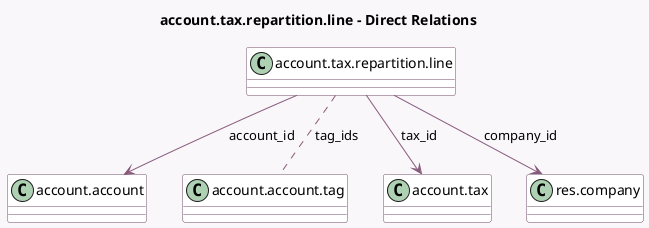

<!-- GENERATED:MODEL -->
---
tags: [odoo, community, generated, model]
---

# account.tax.repartition.line

- Module: [[docs/Community Addons/account/account|account]]
- Scope: Community Addons
- Defined in module: yes
- Source files: `models/account_tax.py`
- Python classes: `AccountTaxRepartitionLine`
- Description: Tax Repartition Line

## Field footprint

- Detected fields: 11
- Field types: `Binary` x 1, `Boolean` x 1, `Float` x 2, `Integer` x 1, `Many2many` x 1, `Many2one` x 3, `Selection` x 2
- Relation fields: 4

## Sample fields

- `account_id`: `Many2one` (comodel `account.account`)
- `company_id`: `Many2one` (comodel `res.company`, related `tax_id.company_id`, store `True`)
- `document_type`: `Selection`
- `factor`: `Float` (compute `_compute_factor`)
- `factor_percent`: `Float`
- `repartition_type`: `Selection`
- `sequence`: `Integer`
- `tag_ids`: `Many2many` (comodel `account.account.tag`)
- `tag_ids_domain`: `Binary` (compute `_compute_tag_ids_domain`)
- `tax_id`: `Many2one` (comodel `account.tax`)
- `use_in_tax_closing`: `Boolean` (compute `_compute_use_in_tax_closing`, store `True`)

## Method hints

- Detected methods: 5
- Action methods: none
- Compute methods: `_compute_factor`, `_compute_tag_ids_domain`, `_compute_use_in_tax_closing`
- Onchange methods: `_onchange_repartition_type`

## Direct relation diagram

## Navigation

- **Parent:** [[docs/Community Addons/account/Models]]

<!-- GENERATED:MODEL -->
