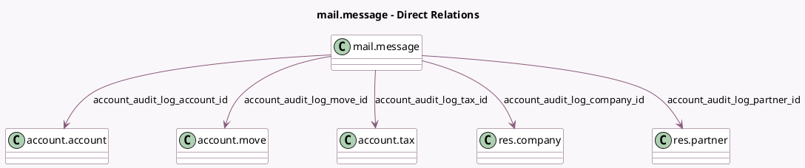

<!-- GENERATED:MODEL -->
---
tags: [odoo, community, generated, model]
---

# mail.message

- Module: [[docs/Community Addons/account/account|account]]
- Scope: Community Addons
- Defined in module: extension only
- Source files: `models/mail_message.py`
- Python classes: `MailMessage`

## Field footprint

- Detected fields: 7
- Field types: `Boolean` x 1, `Many2one` x 5, `Text` x 1
- Relation fields: 5

## Sample fields

- `account_audit_log_account_id`: `Many2one` (comodel `account.account`, compute `_compute_account_audit_log_account_id`)
- `account_audit_log_company_id`: `Many2one` (comodel `res.company`, compute `_compute_account_audit_log_company_id`)
- `account_audit_log_move_id`: `Many2one` (comodel `account.move`, compute `_compute_account_audit_log_move_id`)
- `account_audit_log_partner_id`: `Many2one` (comodel `res.partner`, compute `_compute_account_audit_log_partner_id`)
- `account_audit_log_preview`: `Text` (compute `_compute_account_audit_log_preview`)
- `account_audit_log_restricted`: `Boolean` (compute `_compute_account_audit_log_restricted`)
- `account_audit_log_tax_id`: `Many2one` (comodel `account.tax`, compute `_compute_account_audit_log_tax_id`)

## Method hints

- Detected methods: 18
- Action methods: none
- Compute methods: `_compute_account_audit_log_account_id`, `_compute_account_audit_log_company_id`, `_compute_account_audit_log_move_id`, `_compute_account_audit_log_partner_id`, `_compute_account_audit_log_preview`, `_compute_account_audit_log_restricted`, `_compute_account_audit_log_tax_id`, `_compute_audit_log_related_record_id`
- Onchange methods: none

## Direct relation diagram

## Navigation

- **Parent:** [[docs/Community Addons/account/Models]]

<!-- GENERATED:MODEL -->
