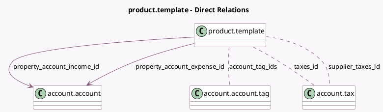

<!-- GENERATED:MODEL -->
---
tags: [odoo, community, generated, model]
---

# product.template

- Module: [[docs/Community Addons/account/account|account]]
- Scope: Community Addons
- Defined in module: extension only
- Source files: `models/product.py`
- Python classes: `ProductTemplate`

## Field footprint

- Detected fields: 7
- Field types: `Char` x 2, `Many2many` x 3, `Many2one` x 2
- Relation fields: 5

## Sample fields

- `account_tag_ids`: `Many2many` (comodel `account.account.tag`)
- `fiscal_country_codes`: `Char` (compute `_compute_fiscal_country_codes`)
- `property_account_expense_id`: `Many2one` (comodel `account.account`)
- `property_account_income_id`: `Many2one` (comodel `account.account`)
- `supplier_taxes_id`: `Many2many` (comodel `account.tax`)
- `tax_string`: `Char` (compute `_compute_tax_string`)
- `taxes_id`: `Many2many` (comodel `account.tax`)

## Method hints

- Detected methods: 12
- Action methods: none
- Compute methods: `_compute_fiscal_country_codes`, `_compute_tax_string`
- Onchange methods: `_onchange_type`

## Direct relation diagram

## Navigation

- **Parent:** [[docs/Community Addons/account/Models]]

<!-- GENERATED:MODEL -->
