<!-- GENERATED:MODEL -->
---
tags: [odoo, community, generated, model]
---

# res.company

- Module: [[docs/Community Addons/account/account|account]]
- Scope: Community Addons
- Defined in module: yes
- Source files: `models/company.py`
- Python classes: `ResCompany`
- Inherits: `mail.thread`

## Field footprint

- Detected fields: 72
- Field types: `Boolean` x 13, `Char` x 5, `Date` x 11, `Html` x 2, `Integer` x 1, `Json` x 1, `Many2many` x 2, `Many2one` x 29, `One2many` x 2, `Selection` x 6
- Relation fields: 33

## Sample fields

- `account_cash_basis_base_account_id`: `Many2one` (comodel `account.account`)
- `account_default_pos_receivable_account_id`: `Many2one` (comodel `account.account`)
- `account_discount_expense_allocation_id`: `Many2one` (comodel `account.account`)
- `account_discount_income_allocation_id`: `Many2one` (comodel `account.account`)
- `account_enabled_tax_country_ids`: `Many2many` (comodel `res.country`, compute `_compute_account_enabled_tax_country_ids`)
- `account_fiscal_country_group_codes`: `Json` (compute `_compute_account_fiscal_country_group_codes`)
- `account_fiscal_country_id`: `Many2one` (comodel `res.country`, compute `compute_account_tax_fiscal_country`, store `True`)
- `account_journal_early_pay_discount_gain_account_id`: `Many2one` (comodel `account.account`)
- `account_journal_early_pay_discount_loss_account_id`: `Many2one` (comodel `account.account`)
- `account_journal_suspense_account_id`: `Many2one` (comodel `account.account`)
- `account_opening_date`: `Date`
- `account_opening_journal_id`: `Many2one` (comodel `account.journal`, related `account_opening_move_id.journal_id`)
- `account_opening_move_id`: `Many2one` (comodel `account.move`)
- `account_price_include`: `Selection`
- `account_purchase_receipt_fiscal_position_id`: `Many2one` (comodel `account.fiscal.position`)
- `account_purchase_tax_id`: `Many2one` (comodel `account.tax`)
- `account_sale_tax_id`: `Many2one` (comodel `account.tax`)
- `account_storno`: `Boolean` (compute `_compute_account_storno`, store `True`)
- `account_use_credit_limit`: `Boolean`
- `anglo_saxon_accounting`: `Boolean`

## Method hints

- Detected methods: 53
- Action methods: `action_save_onboarding_company_data`, `action_save_onboarding_sale_tax`
- Compute methods: `_compute_account_enabled_tax_country_ids`, `_compute_account_fiscal_country_group_codes`, `_compute_account_storno`, `_compute_company_registry_placeholder`, `_compute_company_vat_placeholder`, `_compute_display_account_storno`, `_compute_domestic_fiscal_position_id`, `_compute_force_restrictive_audit_trail`, and 7 more
- Onchange methods: none

## Direct relation diagram

```plantuml
@startuml
!define ODOO_COLOR_PRIMARY #714B67
!define ODOO_COLOR_ACCENT #875A7B
!define ODOO_COLOR_BG #FAF7FA

skinparam backgroundColor ODOO_COLOR_BG
skinparam defaultTextAlignment left
skinparam ArrowColor ODOO_COLOR_ACCENT
skinparam ClassBackgroundColor white
skinparam ClassBorderColor ODOO_COLOR_PRIMARY
skinparam ComponentBackgroundColor white
skinparam ComponentBorderColor ODOO_COLOR_PRIMARY
skinparam NoteBackgroundColor #FFF8FF
skinparam NoteBorderColor ODOO_COLOR_ACCENT
skinparam SequenceLifeLineBorderColor ODOO_COLOR_ACCENT
skinparam SequenceLifeLineBackgroundColor #FFFFFF
skinparam SequenceParticipantBorderColor ODOO_COLOR_PRIMARY
skinparam SequenceParticipantBackgroundColor #FFFFFF
skinparam sequence {
  ArrowColor ODOO_COLOR_ACCENT
  ActorBorderColor ODOO_COLOR_PRIMARY
}
title res.company - Direct Relations
class "res.company" as res_company
class "account.account" as account_account
class "account.fiscal.position" as account_fiscal_position
class "account.incoterms" as account_incoterms
class "account.journal" as account_journal
class "account.move" as account_move
class "account.tax" as account_tax
class "ir.sequence" as ir_sequence
class "res.country" as res_country
res_company --> account_account : transfer_account_id
res_company --> account_account : default_cash_difference_income_account_id
res_company --> account_account : default_cash_difference_expense_account_id
res_company --> account_account : account_journal_suspense_account_id
res_company --> account_account : account_journal_early_pay_discount_gain_account_id
res_company --> account_account : account_journal_early_pay_discount_loss_account_id
res_company --> account_tax : account_sale_tax_id
res_company --> account_tax : account_purchase_tax_id
res_company --> account_fiscal_position : account_purchase_receipt_fiscal_position_id
res_company --> account_journal : currency_exchange_journal_id
res_company --> account_account : income_currency_exchange_account_id
res_company --> account_account : expense_currency_exchange_account_id
res_company --|> account_journal : bank_journal_ids
res_company --> account_incoterms : incoterm_id
res_company --> ir_sequence : batch_payment_sequence_id
res_company --> account_move : account_opening_move_id
res_company --> account_journal : account_opening_journal_id
res_company --> account_account : account_default_pos_receivable_account_id
@enduml
```

## Navigation

- **Parent:** [[docs/Community Addons/account/Models]]

<!-- GENERATED:MODEL -->
