<!-- GENERATED:MODEL -->
---
tags: [odoo, community, generated, model]
---

# res.config.settings

- Module: [[docs/Community Addons/account/account|account]]
- Scope: Community Addons
- Defined in module: extension only
- Source files: `models/res_config_settings.py`
- Python classes: `ResConfigSettings`

## Field footprint

- Detected fields: 63
- Field types: `Boolean` x 36, `Char` x 1, `Html` x 2, `Many2one` x 18, `Monetary` x 1, `Selection` x 5
- Relation fields: 18

## Sample fields

- `account_cash_basis_base_account_id`: `Many2one` (comodel `account.account`, related `company_id.account_cash_basis_base_account_id`)
- `account_default_credit_limit`: `Monetary` (compute `_compute_account_default_credit_limit`)
- `account_discount_expense_allocation_id`: `Many2one` (comodel `account.account`, related `company_id.account_discount_expense_allocation_id`)
- `account_discount_income_allocation_id`: `Many2one` (comodel `account.account`, related `company_id.account_discount_income_allocation_id`)
- `account_fiscal_country_id`: `Many2one` (related `company_id.account_fiscal_country_id`, store `False`)
- `account_journal_early_pay_discount_gain_account_id`: `Many2one` (comodel `account.account`, related `company_id.account_journal_early_pay_discount_gain_account_id`)
- `account_journal_early_pay_discount_loss_account_id`: `Many2one` (comodel `account.account`, related `company_id.account_journal_early_pay_discount_loss_account_id`)
- `account_journal_suspense_account_id`: `Many2one` (comodel `account.account`, related `company_id.account_journal_suspense_account_id`)
- `account_price_include`: `Selection` (related `company_id.account_price_include`)
- `account_storno`: `Boolean` (related `company_id.account_storno`)
- `account_use_credit_limit`: `Boolean` (related `company_id.account_use_credit_limit`)
- `autopost_bills`: `Boolean` (related `company_id.autopost_bills`)
- `chart_template`: `Selection`
- `country_code`: `Char` (related `company_id.account_fiscal_country_id.code`)
- `currency_exchange_journal_id`: `Many2one` (comodel `account.journal`, related `company_id.currency_exchange_journal_id`)
- `currency_id`: `Many2one` (comodel `res.currency`, related `company_id.currency_id`)
- `display_account_storno`: `Boolean` (related `company_id.display_account_storno`)
- `display_invoice_amount_total_words`: `Boolean` (related `company_id.display_invoice_amount_total_words`)
- `display_invoice_tax_company_currency`: `Boolean` (related `company_id.display_invoice_tax_company_currency`)
- `expense_account_id`: `Many2one` (related `company_id.expense_account_id`)

## Method hints

- Detected methods: 14
- Action methods: `action_eu_oss_tax_mapping`, `action_update_terms`
- Compute methods: `_compute_account_default_credit_limit`, `_compute_has_chart_of_accounts`, `_compute_is_account_peppol_eligible`, `_compute_module_account_bank_statement_extract`, `_compute_module_account_invoice_extract`, `_compute_terms_preview`
- Onchange methods: `_onchange_tax_exigibility`, `onchange_analytic_accounting`, `onchange_module_account_budget`

## Direct relation diagram

```plantuml
@startuml
!define ODOO_COLOR_PRIMARY #714B67
!define ODOO_COLOR_ACCENT #875A7B
!define ODOO_COLOR_BG #FAF7FA

skinparam backgroundColor ODOO_COLOR_BG
skinparam defaultTextAlignment left
skinparam ArrowColor ODOO_COLOR_ACCENT
skinparam ClassBackgroundColor white
skinparam ClassBorderColor ODOO_COLOR_PRIMARY
skinparam ComponentBackgroundColor white
skinparam ComponentBorderColor ODOO_COLOR_PRIMARY
skinparam NoteBackgroundColor #FFF8FF
skinparam NoteBorderColor ODOO_COLOR_ACCENT
skinparam SequenceLifeLineBorderColor ODOO_COLOR_ACCENT
skinparam SequenceLifeLineBackgroundColor #FFFFFF
skinparam SequenceParticipantBorderColor ODOO_COLOR_PRIMARY
skinparam SequenceParticipantBackgroundColor #FFFFFF
skinparam sequence {
  ArrowColor ODOO_COLOR_ACCENT
  ActorBorderColor ODOO_COLOR_PRIMARY
}
title res.config.settings - Direct Relations
class "res.config.settings" as res_config_settings
class "account.account" as account_account
class "account.incoterms" as account_incoterms
class "account.journal" as account_journal
class "account.tax" as account_tax
class "res.currency" as res_currency
res_config_settings --> res_currency : currency_id
res_config_settings --> account_journal : currency_exchange_journal_id
res_config_settings --> account_account : income_currency_exchange_account_id
res_config_settings --> account_account : expense_currency_exchange_account_id
res_config_settings --> account_tax : sale_tax_id
res_config_settings --> account_tax : purchase_tax_id
res_config_settings --> account_account : account_journal_suspense_account_id
res_config_settings --> account_account : transfer_account_id
res_config_settings --> account_journal : tax_cash_basis_journal_id
res_config_settings --> account_account : account_cash_basis_base_account_id
res_config_settings --> account_incoterms : incoterm_id
res_config_settings --> account_account : account_journal_early_pay_discount_loss_account_id
res_config_settings --> account_account : account_journal_early_pay_discount_gain_account_id
res_config_settings --> account_account : account_discount_income_allocation_id
res_config_settings --> account_account : account_discount_expense_allocation_id
@enduml
```

## Navigation

- **Parent:** [[docs/Community Addons/account/Models]]

<!-- GENERATED:MODEL -->
