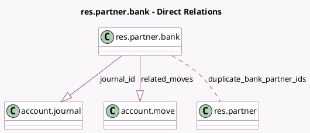

<!-- GENERATED:MODEL -->
---
tags: [odoo, community, generated, model]
---

# res.partner.bank

- Module: [[docs/Community Addons/account/account|account]]
- Scope: Community Addons
- Defined in module: yes
- Source files: `models/res_partner_bank.py`
- Python classes: `ResPartnerBank`
- Inherits: `mail.activity.mixin`, `mail.thread`

## Field footprint

- Detected fields: 19
- Field types: `Boolean` x 6, `Char` x 5, `Integer` x 2, `Many2many` x 1, `Many2one` x 3, `One2many` x 2
- Relation fields: 6

## Sample fields

- `acc_holder_name`: `Char`
- `acc_number`: `Char`
- `active`: `Boolean`
- `allow_out_payment`: `Boolean`
- `bank_id`: `Many2one`
- `clearing_number`: `Char`
- `currency_id`: `Many2one`
- `duplicate_bank_partner_ids`: `Many2many` (comodel `res.partner`, compute `_compute_duplicate_bank_partner_ids`)
- `has_iban_warning`: `Boolean` (compute `_compute_display_account_warning`, store `True`)
- `has_money_transfer_warning`: `Boolean` (compute `_compute_display_account_warning`, store `True`)
- `journal_id`: `One2many` (comodel `account.journal`)
- `lock_trust_fields`: `Boolean` (compute `_compute_lock_trust_fields`)
- `money_transfer_service`: `Char` (compute `_compute_money_transfer_service_name`)
- `partner_country_name`: `Char` (related `partner_id.country_id.name`)
- `partner_customer_rank`: `Integer` (related `partner_id.customer_rank`)
- `partner_id`: `Many2one`
- `partner_supplier_rank`: `Integer` (related `partner_id.supplier_rank`)
- `related_moves`: `One2many` (comodel `account.move`)
- `user_has_group_validate_bank_account`: `Boolean` (compute `_compute_user_has_group_validate_bank_account`)

## Method hints

- Detected methods: 24
- Action methods: none
- Compute methods: `_compute_display_account_warning`, `_compute_display_name`, `_compute_duplicate_bank_partner_ids`, `_compute_lock_trust_fields`, `_compute_money_transfer_service_name`, `_compute_user_has_group_validate_bank_account`
- Onchange methods: none

## Direct relation diagram

## Navigation

- **Parent:** [[docs/Community Addons/account/Models]]

<!-- GENERATED:MODEL -->
