<!-- GENERATED:MODEL -->
---
tags: [odoo, community, generated, model]
---

# res.partner

- Module: [[docs/Community Addons/account/account|account]]
- Scope: Community Addons
- Defined in module: extension only
- Source files: `models/partner.py`
- Python classes: `ResPartner`

## Field footprint

- Detected fields: 41
- Field types: `Boolean` x 6, `Char` x 5, `Float` x 2, `Integer` x 5, `Json` x 1, `Many2many` x 1, `Many2one` x 9, `Monetary` x 4, `One2many` x 4, `Selection` x 4
- Relation fields: 14

## Sample fields

- `account_move_count`: `Integer` (compute `_compute_account_move_count`)
- `autopost_bills`: `Selection`
- `available_invoice_template_pdf_report_ids`: `One2many` (comodel `ir.actions.report`, compute `_compute_available_invoice_template_pdf_report_ids`)
- `bank_account_count`: `Integer` (compute `_compute_bank_count`)
- `contract_ids`: `One2many` (comodel `account.analytic.account`)
- `credit`: `Monetary` (compute `_credit_debit_get`)
- `credit_limit`: `Float`
- `credit_to_invoice`: `Monetary` (compute `_compute_credit_to_invoice`)
- `currency_id`: `Many2one` (comodel `res.currency`, compute `_get_company_currency`)
- `customer_rank`: `Integer`
- `days_sales_outstanding`: `Float` (compute `_compute_days_sales_outstanding`)
- `debit`: `Monetary` (compute `_credit_debit_get`)
- `display_invoice_edi_format`: `Boolean` (store `False`)
- `display_invoice_template_pdf_report_id`: `Boolean` (store `False`)
- `duplicate_bank_partner_ids`: `Many2many` (related `bank_ids.duplicate_bank_partner_ids`)
- `fiscal_country_codes`: `Char` (compute `_compute_fiscal_country_codes`)
- `fiscal_country_group_codes`: `Json` (compute `_compute_fiscal_country_group_codes`)
- `ignore_abnormal_invoice_amount`: `Boolean`
- `ignore_abnormal_invoice_date`: `Boolean`
- `invoice_edi_format`: `Selection` (compute `_compute_invoice_edi_format`)

## Method hints

- Detected methods: 48
- Action methods: `action_open_business_doc`, `action_view_partner_invoices`
- Compute methods: `_compute_account_move_count`, `_compute_application_statistics_hook`, `_compute_available_invoice_template_pdf_report_ids`, `_compute_bank_count`, `_compute_credit_to_invoice`, `_compute_days_sales_outstanding`, `_compute_fiscal_country_codes`, `_compute_fiscal_country_group_codes`, and 6 more
- Onchange methods: none

## Direct relation diagram

```plantuml
@startuml
!define ODOO_COLOR_PRIMARY #714B67
!define ODOO_COLOR_ACCENT #875A7B
!define ODOO_COLOR_BG #FAF7FA

skinparam backgroundColor ODOO_COLOR_BG
skinparam defaultTextAlignment left
skinparam ArrowColor ODOO_COLOR_ACCENT
skinparam ClassBackgroundColor white
skinparam ClassBorderColor ODOO_COLOR_PRIMARY
skinparam ComponentBackgroundColor white
skinparam ComponentBorderColor ODOO_COLOR_PRIMARY
skinparam NoteBackgroundColor #FFF8FF
skinparam NoteBorderColor ODOO_COLOR_ACCENT
skinparam SequenceLifeLineBorderColor ODOO_COLOR_ACCENT
skinparam SequenceLifeLineBackgroundColor #FFFFFF
skinparam SequenceParticipantBorderColor ODOO_COLOR_PRIMARY
skinparam SequenceParticipantBackgroundColor #FFFFFF
skinparam sequence {
  ArrowColor ODOO_COLOR_ACCENT
  ActorBorderColor ODOO_COLOR_PRIMARY
}
title res.partner - Direct Relations
class "res.partner" as res_partner
class "account.account" as account_account
class "account.analytic.account" as account_analytic_account
class "account.fiscal.position" as account_fiscal_position
class "account.move" as account_move
class "account.payment.method.line" as account_payment_method_line
class "account.payment.term" as account_payment_term
class "ir.actions.report" as ir_actions_report
class "res.company" as res_company
class "res.currency" as res_currency
res_partner --> res_currency : currency_id
res_partner --> account_account : property_account_payable_id
res_partner --> account_account : property_account_receivable_id
res_partner --> account_fiscal_position : property_account_position_id
res_partner --> account_payment_term : property_payment_term_id
res_partner --> account_payment_term : property_supplier_payment_term_id
res_partner --|> res_company : ref_company_ids
res_partner --|> account_move : invoice_ids
res_partner --|> account_analytic_account : contract_ids
res_partner --> ir_actions_report : invoice_template_pdf_report_id
res_partner --|> ir_actions_report : available_invoice_template_pdf_report_ids
res_partner --> account_payment_method_line : property_outbound_payment_method_line_id
res_partner --> account_payment_method_line : property_inbound_payment_method_line_id
@enduml
```

## Navigation

- **Parent:** [[docs/Community Addons/account/Models]]

<!-- GENERATED:MODEL -->
