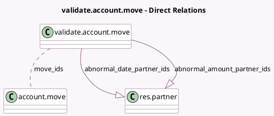

<!-- GENERATED:MODEL -->
---
tags: [odoo, community, generated, model]
---

# validate.account.move

- Module: [[docs/Community Addons/account/account|account]]
- Scope: Community Addons
- Defined in module: yes
- Source files: `wizard/account_validate_account_move.py`
- Python classes: `ValidateAccountMove`
- Description: Validate Account Move

## Field footprint

- Detected fields: 10
- Field types: `Boolean` x 7, `Many2many` x 1, `One2many` x 2
- Relation fields: 3

## Sample fields

- `abnormal_amount_partner_ids`: `One2many` (comodel `res.partner`, compute `_compute_abnormal_amount_partner_ids`)
- `abnormal_date_partner_ids`: `One2many` (comodel `res.partner`, compute `_compute_abnormal_date_partner_ids`)
- `display_force_hash`: `Boolean` (compute `_compute_display_force_hash`)
- `display_force_post`: `Boolean` (compute `_compute_display_force_post`)
- `force_hash`: `Boolean`
- `force_post`: `Boolean`
- `ignore_abnormal_amount`: `Boolean`
- `ignore_abnormal_date`: `Boolean`
- `is_entries`: `Boolean` (compute `_compute_is_entries`)
- `move_ids`: `Many2many` (comodel `account.move`)

## Method hints

- Detected methods: 7
- Action methods: none
- Compute methods: `_compute_abnormal_amount_partner_ids`, `_compute_abnormal_date_partner_ids`, `_compute_display_force_hash`, `_compute_display_force_post`, `_compute_is_entries`
- Onchange methods: none

## Direct relation diagram

## Navigation

- **Parent:** [[docs/Community Addons/account/Models]]

<!-- GENERATED:MODEL -->
