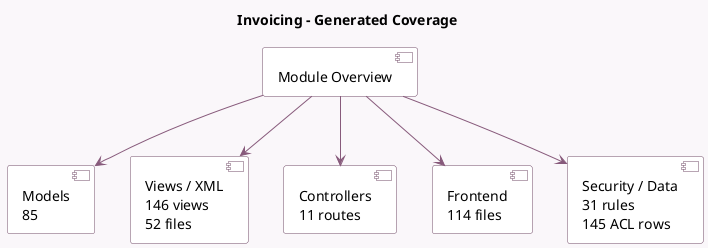

<!-- GENERATED:MODULE -->
---
tags: [odoo, community, module]
---

# Invoicing

- Scope: Community Addons
- Source: odoo/addons/account
- Dependencies: [[docs/Community Addons/base_setup/base_setup|base_setup]], [[docs/Community Addons/onboarding/onboarding|onboarding]], [[docs/Community Addons/product/product|product]], [[docs/Community Addons/analytic/analytic|analytic]], [[docs/Community Addons/portal/portal|portal]], [[docs/Community Addons/digest/digest|digest]]

## Summary

Invoices & Payments

## Generated coverage

- Models: 85
- XML files with UI/data artifacts: 52
- Views: 146
- Actions: 80
- Menus: 53
- Rules (ir.rule): 31
- Access CSV entries: 145
- Controller units: 5
- Frontend asset files: 114

## Module map

## Detail notes

- Models: [[docs/Community Addons/account/Models|Models]] (85)
- Views and XML: [[docs/Community Addons/account/Views|Views]] (52 files)
- Controllers: [[docs/Community Addons/account/Controllers|Controllers]] (5)
- Frontend: [[docs/Community Addons/account/Frontend|Frontend]] (114 files)

## Key models

- `account.account`
- `account.account.tag`
- `account.accrued.orders.wizard`
- `account.analytic.account`
- `account.analytic.applicability`
- `account.analytic.distribution.model`
- `account.analytic.line`
- `account.automatic.entry.wizard`
- `account.autopost.bills.wizard`
- `account.bank.statement`
- `account.bank.statement.line`
- `account.cash.rounding`

## Navigation

- [[../Community Addons/Community Addons|Back to scope]]
- [[../../docs/docs|Back to docs]]

<!-- GENERATED:MODULE -->

