<!-- GENERATED:MODEL -->
---
tags: [odoo, community, generated, model]
---

# account.debit.note

- Module: [[docs/Community Addons/account_debit_note/account_debit_note|account_debit_note]]
- Scope: Community Addons
- Defined in module: yes
- Source files: `wizard/account_debit_note.py`
- Python classes: `AccountDebitNote`
- Description: Add Debit Note wizard

## Field footprint

- Detected fields: 8
- Field types: `Boolean` x 1, `Char` x 4, `Date` x 1, `Many2many` x 1, `Many2one` x 1
- Relation fields: 2

## Sample fields

- `copy_lines`: `Boolean` (comodel `Copy Lines`)
- `country_code`: `Char` (related `move_ids.company_id.country_id.code`)
- `date`: `Date`
- `journal_id`: `Many2one` (comodel `account.journal`)
- `journal_type`: `Char` (compute `_compute_journal_type`)
- `move_ids`: `Many2many` (comodel `account.move`)
- `move_type`: `Char` (compute `_compute_from_moves`)
- `reason`: `Char`

## Method hints

- Detected methods: 5
- Action methods: none
- Compute methods: `_compute_from_moves`, `_compute_journal_type`
- Onchange methods: none

## Direct relation diagram

```plantuml
@startuml
!define ODOO_COLOR_PRIMARY #714B67
!define ODOO_COLOR_ACCENT #875A7B
!define ODOO_COLOR_BG #FAF7FA

skinparam backgroundColor ODOO_COLOR_BG
skinparam defaultTextAlignment left
skinparam ArrowColor ODOO_COLOR_ACCENT
skinparam ClassBackgroundColor white
skinparam ClassBorderColor ODOO_COLOR_PRIMARY
skinparam ComponentBackgroundColor white
skinparam ComponentBorderColor ODOO_COLOR_PRIMARY
skinparam NoteBackgroundColor #FFF8FF
skinparam NoteBorderColor ODOO_COLOR_ACCENT
skinparam SequenceLifeLineBorderColor ODOO_COLOR_ACCENT
skinparam SequenceLifeLineBackgroundColor #FFFFFF
skinparam SequenceParticipantBorderColor ODOO_COLOR_PRIMARY
skinparam SequenceParticipantBackgroundColor #FFFFFF
skinparam sequence {
  ArrowColor ODOO_COLOR_ACCENT
  ActorBorderColor ODOO_COLOR_PRIMARY
}
title account.debit.note - Direct Relations
class "account.debit.note" as account_debit_note
class "account.journal" as account_journal
class "account.move" as account_move
account_debit_note .. account_move : move_ids
account_debit_note --> account_journal : journal_id
@enduml
```

## Navigation

- **Parent:** [[docs/Community Addons/account_debit_note/Models]]

<!-- GENERATED:MODEL -->
