<!-- GENERATED:MODEL -->
---
tags: [odoo, community, generated, model]
---

# account.edi.document

- Module: [[docs/Community Addons/account_edi/account_edi|account_edi]]
- Scope: Community Addons
- Defined in module: yes
- Source files: `models/account_edi_document.py`
- Python classes: `AccountEdiDocument`
- Description: Electronic Document for an account.move

## Field footprint

- Detected fields: 9
- Field types: `Binary` x 1, `Char` x 2, `Html` x 1, `Many2one` x 3, `Selection` x 2
- Relation fields: 3

## Sample fields

- `attachment_id`: `Many2one` (comodel `ir.attachment`)
- `blocking_level`: `Selection`
- `edi_content`: `Binary` (compute `_compute_edi_content`)
- `edi_format_id`: `Many2one` (comodel `account.edi.format`)
- `edi_format_name`: `Char` (related `edi_format_id.name`)
- `error`: `Html`
- `move_id`: `Many2one` (comodel `account.move`)
- `name`: `Char` (related `attachment_id.name`)
- `state`: `Selection`

## Method hints

- Detected methods: 8
- Action methods: `action_export_xml`
- Compute methods: `_compute_edi_content`
- Onchange methods: none

## Direct relation diagram

```plantuml
@startuml
!define ODOO_COLOR_PRIMARY #714B67
!define ODOO_COLOR_ACCENT #875A7B
!define ODOO_COLOR_BG #FAF7FA

skinparam backgroundColor ODOO_COLOR_BG
skinparam defaultTextAlignment left
skinparam ArrowColor ODOO_COLOR_ACCENT
skinparam ClassBackgroundColor white
skinparam ClassBorderColor ODOO_COLOR_PRIMARY
skinparam ComponentBackgroundColor white
skinparam ComponentBorderColor ODOO_COLOR_PRIMARY
skinparam NoteBackgroundColor #FFF8FF
skinparam NoteBorderColor ODOO_COLOR_ACCENT
skinparam SequenceLifeLineBorderColor ODOO_COLOR_ACCENT
skinparam SequenceLifeLineBackgroundColor #FFFFFF
skinparam SequenceParticipantBorderColor ODOO_COLOR_PRIMARY
skinparam SequenceParticipantBackgroundColor #FFFFFF
skinparam sequence {
  ArrowColor ODOO_COLOR_ACCENT
  ActorBorderColor ODOO_COLOR_PRIMARY
}
title account.edi.document - Direct Relations
class "account.edi.document" as account_edi_document
class "account.edi.format" as account_edi_format
class "account.move" as account_move
class "ir.attachment" as ir_attachment
account_edi_document --> account_move : move_id
account_edi_document --> account_edi_format : edi_format_id
account_edi_document --> ir_attachment : attachment_id
@enduml
```

## Navigation

- **Parent:** [[docs/Community Addons/account_edi/Models]]

<!-- GENERATED:MODEL -->
