<!-- GENERATED:MODEL -->
---
tags: [odoo, community, generated, model]
---

# account.journal

- Module: [[docs/Community Addons/account_edi/account_edi|account_edi]]
- Scope: Community Addons
- Defined in module: extension only
- Source files: `models/account_journal.py`
- Python classes: `AccountJournal`

## Field footprint

- Detected fields: 2
- Field types: `Many2many` x 2
- Relation fields: 2

## Sample fields

- `compatible_edi_ids`: `Many2many` (comodel `account.edi.format`, compute `_compute_compatible_edi_ids`)
- `edi_format_ids`: `Many2many` (comodel `account.edi.format`, compute `_compute_edi_format_ids`, store `True`)

## Method hints

- Detected methods: 3
- Action methods: none
- Compute methods: `_compute_compatible_edi_ids`, `_compute_edi_format_ids`
- Onchange methods: none

## Direct relation diagram

```plantuml
@startuml
!define ODOO_COLOR_PRIMARY #714B67
!define ODOO_COLOR_ACCENT #875A7B
!define ODOO_COLOR_BG #FAF7FA

skinparam backgroundColor ODOO_COLOR_BG
skinparam defaultTextAlignment left
skinparam ArrowColor ODOO_COLOR_ACCENT
skinparam ClassBackgroundColor white
skinparam ClassBorderColor ODOO_COLOR_PRIMARY
skinparam ComponentBackgroundColor white
skinparam ComponentBorderColor ODOO_COLOR_PRIMARY
skinparam NoteBackgroundColor #FFF8FF
skinparam NoteBorderColor ODOO_COLOR_ACCENT
skinparam SequenceLifeLineBorderColor ODOO_COLOR_ACCENT
skinparam SequenceLifeLineBackgroundColor #FFFFFF
skinparam SequenceParticipantBorderColor ODOO_COLOR_PRIMARY
skinparam SequenceParticipantBackgroundColor #FFFFFF
skinparam sequence {
  ArrowColor ODOO_COLOR_ACCENT
  ActorBorderColor ODOO_COLOR_PRIMARY
}
title account.journal - Direct Relations
class "account.journal" as account_journal
class "account.edi.format" as account_edi_format
account_journal .. account_edi_format : edi_format_ids
account_journal .. account_edi_format : compatible_edi_ids
@enduml
```

## Navigation

- **Parent:** [[docs/Community Addons/account_edi/Models]]

<!-- GENERATED:MODEL -->
