<!-- GENERATED:MODEL -->
---
tags: [odoo, community, generated, model]
---

# account.move

- Module: [[docs/Community Addons/account_edi/account_edi|account_edi]]
- Scope: Community Addons
- Defined in module: extension only
- Source files: `models/account_move.py`
- Python classes: `AccountMove`

## Field footprint

- Detected fields: 9
- Field types: `Boolean` x 3, `Html` x 1, `Integer` x 1, `One2many` x 1, `Selection` x 2, `Text` x 1
- Relation fields: 1

## Sample fields

- `edi_blocking_level`: `Selection` (compute `_compute_edi_error_message`)
- `edi_document_ids`: `One2many` (comodel `account.edi.document`)
- `edi_error_count`: `Integer` (compute `_compute_edi_error_count`)
- `edi_error_message`: `Html` (compute `_compute_edi_error_message`)
- `edi_show_abandon_cancel_button`: `Boolean` (compute `_compute_edi_show_abandon_cancel_button`)
- `edi_show_cancel_button`: `Boolean` (compute `_compute_edi_show_cancel_button`)
- `edi_show_force_cancel_button`: `Boolean` (compute `_compute_edi_show_force_cancel_button`)
- `edi_state`: `Selection` (compute `_compute_edi_state`, store `True`)
- `edi_web_services_to_process`: `Text` (compute `_compute_edi_web_services_to_process`)

## Method hints

- Detected methods: 26
- Action methods: `action_process_edi_web_services`, `action_retry_edi_documents_error`
- Compute methods: `_compute_edi_error_count`, `_compute_edi_error_message`, `_compute_edi_show_abandon_cancel_button`, `_compute_edi_show_cancel_button`, `_compute_edi_show_force_cancel_button`, `_compute_edi_state`, `_compute_edi_web_services_to_process`, `_compute_show_reset_to_draft_button`
- Onchange methods: none

## Direct relation diagram

```plantuml
@startuml
!define ODOO_COLOR_PRIMARY #714B67
!define ODOO_COLOR_ACCENT #875A7B
!define ODOO_COLOR_BG #FAF7FA

skinparam backgroundColor ODOO_COLOR_BG
skinparam defaultTextAlignment left
skinparam ArrowColor ODOO_COLOR_ACCENT
skinparam ClassBackgroundColor white
skinparam ClassBorderColor ODOO_COLOR_PRIMARY
skinparam ComponentBackgroundColor white
skinparam ComponentBorderColor ODOO_COLOR_PRIMARY
skinparam NoteBackgroundColor #FFF8FF
skinparam NoteBorderColor ODOO_COLOR_ACCENT
skinparam SequenceLifeLineBorderColor ODOO_COLOR_ACCENT
skinparam SequenceLifeLineBackgroundColor #FFFFFF
skinparam SequenceParticipantBorderColor ODOO_COLOR_PRIMARY
skinparam SequenceParticipantBackgroundColor #FFFFFF
skinparam sequence {
  ArrowColor ODOO_COLOR_ACCENT
  ActorBorderColor ODOO_COLOR_PRIMARY
}
title account.move - Direct Relations
class "account.move" as account_move
class "account.edi.document" as account_edi_document
account_move --|> account_edi_document : edi_document_ids
@enduml
```

## Navigation

- **Parent:** [[docs/Community Addons/account_edi/Models]]

<!-- GENERATED:MODEL -->
