<!-- GENERATED:MODEL -->
---
tags: [odoo, community, generated, model]
---

# account_edi_proxy_client.user

- Module: [[docs/Community Addons/account_edi_proxy_client/account_edi_proxy_client|account_edi_proxy_client]]
- Scope: Community Addons
- Defined in module: yes
- Source files: `models/account_edi_proxy_user.py`
- Python classes: `Account_Edi_Proxy_ClientUser`
- Description: Account EDI proxy user

## Field footprint

- Detected fields: 10
- Field types: `Boolean` x 2, `Char` x 3, `Integer` x 1, `Many2one` x 2, `Selection` x 2
- Relation fields: 2

## Sample fields

- `active`: `Boolean`
- `company_id`: `Many2one` (comodel `res.company`)
- `edi_identification`: `Char`
- `edi_mode`: `Selection`
- `id_client`: `Char`
- `is_token_out_of_sync`: `Boolean`
- `private_key_id`: `Many2one` (comodel `certificate.key`)
- `proxy_type`: `Selection`
- `refresh_token`: `Char`
- `token_sync_version`: `Integer`

## Method hints

- Detected methods: 9
- Action methods: none
- Compute methods: none
- Onchange methods: none

## Direct relation diagram

```plantuml
@startuml
!define ODOO_COLOR_PRIMARY #714B67
!define ODOO_COLOR_ACCENT #875A7B
!define ODOO_COLOR_BG #FAF7FA

skinparam backgroundColor ODOO_COLOR_BG
skinparam defaultTextAlignment left
skinparam ArrowColor ODOO_COLOR_ACCENT
skinparam ClassBackgroundColor white
skinparam ClassBorderColor ODOO_COLOR_PRIMARY
skinparam ComponentBackgroundColor white
skinparam ComponentBorderColor ODOO_COLOR_PRIMARY
skinparam NoteBackgroundColor #FFF8FF
skinparam NoteBorderColor ODOO_COLOR_ACCENT
skinparam SequenceLifeLineBorderColor ODOO_COLOR_ACCENT
skinparam SequenceLifeLineBackgroundColor #FFFFFF
skinparam SequenceParticipantBorderColor ODOO_COLOR_PRIMARY
skinparam SequenceParticipantBackgroundColor #FFFFFF
skinparam sequence {
  ArrowColor ODOO_COLOR_ACCENT
  ActorBorderColor ODOO_COLOR_PRIMARY
}
title account_edi_proxy_client.user - Direct Relations
class "account_edi_proxy_client.user" as account_edi_proxy_client_user
class "certificate.key" as certificate_key
class "res.company" as res_company
account_edi_proxy_client_user --> res_company : company_id
account_edi_proxy_client_user --> certificate_key : private_key_id
@enduml
```

## Navigation

- **Parent:** [[docs/Community Addons/account_edi_proxy_client/Models]]

<!-- GENERATED:MODEL -->
