<!-- GENERATED:MODEL -->
---
tags: [odoo, community, generated, model]
---

# account.move

- Module: [[docs/Community Addons/account_edi_ubl_cii/account_edi_ubl_cii|account_edi_ubl_cii]]
- Scope: Community Addons
- Defined in module: extension only
- Source files: `models/account_move.py`
- Python classes: `AccountMove`

## Field footprint

- Detected fields: 3
- Field types: `Binary` x 1, `Char` x 1, `Many2one` x 1
- Relation fields: 1

## Sample fields

- `ubl_cii_xml_file`: `Binary`
- `ubl_cii_xml_filename`: `Char` (compute `_compute_filename`)
- `ubl_cii_xml_id`: `Many2one` (comodel `ir.attachment`)

## Method hints

- Detected methods: 13
- Action methods: `action_invoice_download_ubl`
- Compute methods: `_compute_filename`
- Onchange methods: none

## Direct relation diagram

```plantuml
@startuml
!define ODOO_COLOR_PRIMARY #714B67
!define ODOO_COLOR_ACCENT #875A7B
!define ODOO_COLOR_BG #FAF7FA

skinparam backgroundColor ODOO_COLOR_BG
skinparam defaultTextAlignment left
skinparam ArrowColor ODOO_COLOR_ACCENT
skinparam ClassBackgroundColor white
skinparam ClassBorderColor ODOO_COLOR_PRIMARY
skinparam ComponentBackgroundColor white
skinparam ComponentBorderColor ODOO_COLOR_PRIMARY
skinparam NoteBackgroundColor #FFF8FF
skinparam NoteBorderColor ODOO_COLOR_ACCENT
skinparam SequenceLifeLineBorderColor ODOO_COLOR_ACCENT
skinparam SequenceLifeLineBackgroundColor #FFFFFF
skinparam SequenceParticipantBorderColor ODOO_COLOR_PRIMARY
skinparam SequenceParticipantBackgroundColor #FFFFFF
skinparam sequence {
  ArrowColor ODOO_COLOR_ACCENT
  ActorBorderColor ODOO_COLOR_PRIMARY
}
title account.move - Direct Relations
class "account.move" as account_move
class "ir.attachment" as ir_attachment
account_move --> ir_attachment : ubl_cii_xml_id
@enduml
```

## Navigation

- **Parent:** [[docs/Community Addons/account_edi_ubl_cii/Models]]

<!-- GENERATED:MODEL -->
