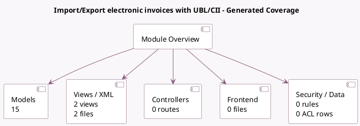

<!-- GENERATED:MODULE -->
---
tags: [odoo, community, module]
---

# Import/Export electronic invoices with UBL/CII

- Scope: Community Addons
- Source: odoo/addons/account_edi_ubl_cii
- Dependencies: [[docs/Community Addons/account/account|account]]

## Generated coverage

- Models: 15
- XML files with UI/data artifacts: 2
- Views: 2
- Actions: 0
- Menus: 0
- Rules (ir.rule): 0
- Access CSV entries: 0
- Controller units: 0
- Frontend asset files: 0

## Module map

## Detail notes

- Models: [[docs/Community Addons/account_edi_ubl_cii/Models|Models]] (15)
- Views and XML: [[docs/Community Addons/account_edi_ubl_cii/Views|Views]] (2 files)

## Key models

- `account.edi.common`
- `account.edi.xml.cii`
- `account.edi.xml.ubl_20`
- `account.edi.xml.ubl_21`
- `account.edi.xml.ubl_a_nz`
- `account.edi.xml.ubl_bis3`
- `account.edi.xml.ubl_de`
- `account.edi.xml.ubl_efff`
- `account.edi.xml.ubl_nl`
- `account.edi.xml.ubl_sg`
- `account.move`
- `account.move.send`

## Navigation

- [[../Community Addons/Community Addons|Back to scope]]
- [[../../docs/docs|Back to docs]]

<!-- GENERATED:MODULE -->

