<!-- GENERATED:MODEL -->
---
tags: [odoo, community, generated, model]
---

# fleet.vehicle.log.services

- Module: [[docs/Community Addons/account_fleet/account_fleet|account_fleet]]
- Scope: Community Addons
- Defined in module: extension only
- Source files: `models/fleet_vehicle_log_services.py`
- Python classes: `FleetVehicleLogServices`

## Field footprint

- Detected fields: 4
- Field types: `Many2one` x 2, `Monetary` x 1, `Selection` x 1
- Relation fields: 2

## Sample fields

- `account_move_line_id`: `Many2one` (comodel `account.move.line`)
- `account_move_state`: `Selection` (related `account_move_line_id.parent_state`)
- `amount`: `Monetary` (compute `_compute_amount`, store `True`)
- `vehicle_id`: `Many2one` (comodel `fleet.vehicle`, compute `_compute_vehicle_id`, store `True`)

## Method hints

- Detected methods: 5
- Action methods: `action_open_account_move`
- Compute methods: `_compute_amount`, `_compute_vehicle_id`
- Onchange methods: none

## Direct relation diagram

```plantuml
@startuml
!define ODOO_COLOR_PRIMARY #714B67
!define ODOO_COLOR_ACCENT #875A7B
!define ODOO_COLOR_BG #FAF7FA

skinparam backgroundColor ODOO_COLOR_BG
skinparam defaultTextAlignment left
skinparam ArrowColor ODOO_COLOR_ACCENT
skinparam ClassBackgroundColor white
skinparam ClassBorderColor ODOO_COLOR_PRIMARY
skinparam ComponentBackgroundColor white
skinparam ComponentBorderColor ODOO_COLOR_PRIMARY
skinparam NoteBackgroundColor #FFF8FF
skinparam NoteBorderColor ODOO_COLOR_ACCENT
skinparam SequenceLifeLineBorderColor ODOO_COLOR_ACCENT
skinparam SequenceLifeLineBackgroundColor #FFFFFF
skinparam SequenceParticipantBorderColor ODOO_COLOR_PRIMARY
skinparam SequenceParticipantBackgroundColor #FFFFFF
skinparam sequence {
  ArrowColor ODOO_COLOR_ACCENT
  ActorBorderColor ODOO_COLOR_PRIMARY
}
title fleet.vehicle.log.services - Direct Relations
class "fleet.vehicle.log.services" as fleet_vehicle_log_services
class "account.move.line" as account_move_line
class "fleet.vehicle" as fleet_vehicle
fleet_vehicle_log_services --> account_move_line : account_move_line_id
fleet_vehicle_log_services --> fleet_vehicle : vehicle_id
@enduml
```

## Navigation

- **Parent:** [[docs/Community Addons/account_fleet/Models]]

<!-- GENERATED:MODEL -->
