<!-- GENERATED:MODEL -->
---
tags: [odoo, community, generated, model]
---

# account.payment.method.line

- Module: [[docs/Community Addons/account_payment/account_payment|account_payment]]
- Scope: Community Addons
- Defined in module: extension only
- Source files: `models/account_payment_method_line.py`
- Python classes: `AccountPaymentMethodLine`

## Field footprint

- Detected fields: 2
- Field types: `Many2one` x 1, `Selection` x 1
- Relation fields: 1

## Sample fields

- `payment_provider_id`: `Many2one` (comodel `payment.provider`, compute `_compute_payment_provider_id`, store `True`)
- `payment_provider_state`: `Selection` (related `payment_provider_id.state`)

## Method hints

- Detected methods: 4
- Action methods: `action_open_provider_form`
- Compute methods: `_compute_name`, `_compute_payment_provider_id`
- Onchange methods: none

## Direct relation diagram

```plantuml
@startuml
!define ODOO_COLOR_PRIMARY #714B67
!define ODOO_COLOR_ACCENT #875A7B
!define ODOO_COLOR_BG #FAF7FA

skinparam backgroundColor ODOO_COLOR_BG
skinparam defaultTextAlignment left
skinparam ArrowColor ODOO_COLOR_ACCENT
skinparam ClassBackgroundColor white
skinparam ClassBorderColor ODOO_COLOR_PRIMARY
skinparam ComponentBackgroundColor white
skinparam ComponentBorderColor ODOO_COLOR_PRIMARY
skinparam NoteBackgroundColor #FFF8FF
skinparam NoteBorderColor ODOO_COLOR_ACCENT
skinparam SequenceLifeLineBorderColor ODOO_COLOR_ACCENT
skinparam SequenceLifeLineBackgroundColor #FFFFFF
skinparam SequenceParticipantBorderColor ODOO_COLOR_PRIMARY
skinparam SequenceParticipantBackgroundColor #FFFFFF
skinparam sequence {
  ArrowColor ODOO_COLOR_ACCENT
  ActorBorderColor ODOO_COLOR_PRIMARY
}
title account.payment.method.line - Direct Relations
class "account.payment.method.line" as account_payment_method_line
class "payment.provider" as payment_provider
account_payment_method_line --> payment_provider : payment_provider_id
@enduml
```

## Navigation

- **Parent:** [[docs/Community Addons/account_payment/Models]]

<!-- GENERATED:MODEL -->
