<!-- GENERATED:MODEL -->
---
tags: [odoo, community, generated, model]
---

# account.payment.register

- Module: [[docs/Community Addons/account_payment/account_payment|account_payment]]
- Scope: Community Addons
- Defined in module: extension only
- Source files: `wizards/account_payment_register.py`
- Python classes: `AccountPaymentRegister`

## Field footprint

- Detected fields: 4
- Field types: `Boolean` x 1, `Char` x 1, `Many2many` x 1, `Many2one` x 1
- Relation fields: 2

## Sample fields

- `payment_method_code`: `Char` (related `payment_method_line_id.code`)
- `payment_token_id`: `Many2one` (comodel `payment.token`, compute `_compute_payment_token_id`, store `True`)
- `suitable_payment_token_ids`: `Many2many` (comodel `payment.token`, compute `_compute_suitable_payment_token_ids`)
- `use_electronic_payment_method`: `Boolean` (compute `_compute_use_electronic_payment_method`)

## Method hints

- Detected methods: 4
- Action methods: none
- Compute methods: `_compute_payment_token_id`, `_compute_suitable_payment_token_ids`, `_compute_use_electronic_payment_method`
- Onchange methods: `_compute_payment_token_id`

## Direct relation diagram

```plantuml
@startuml
!define ODOO_COLOR_PRIMARY #714B67
!define ODOO_COLOR_ACCENT #875A7B
!define ODOO_COLOR_BG #FAF7FA

skinparam backgroundColor ODOO_COLOR_BG
skinparam defaultTextAlignment left
skinparam ArrowColor ODOO_COLOR_ACCENT
skinparam ClassBackgroundColor white
skinparam ClassBorderColor ODOO_COLOR_PRIMARY
skinparam ComponentBackgroundColor white
skinparam ComponentBorderColor ODOO_COLOR_PRIMARY
skinparam NoteBackgroundColor #FFF8FF
skinparam NoteBorderColor ODOO_COLOR_ACCENT
skinparam SequenceLifeLineBorderColor ODOO_COLOR_ACCENT
skinparam SequenceLifeLineBackgroundColor #FFFFFF
skinparam SequenceParticipantBorderColor ODOO_COLOR_PRIMARY
skinparam SequenceParticipantBackgroundColor #FFFFFF
skinparam sequence {
  ArrowColor ODOO_COLOR_ACCENT
  ActorBorderColor ODOO_COLOR_PRIMARY
}
title account.payment.register - Direct Relations
class "account.payment.register" as account_payment_register
class "payment.token" as payment_token
account_payment_register --> payment_token : payment_token_id
account_payment_register .. payment_token : suitable_payment_token_ids
@enduml
```

## Navigation

- **Parent:** [[docs/Community Addons/account_payment/Models]]

<!-- GENERATED:MODEL -->
