<!-- GENERATED:MODEL -->
---
tags: [odoo, community, generated, model]
---

# payment.refund.wizard

- Module: [[docs/Community Addons/account_payment/account_payment|account_payment]]
- Scope: Community Addons
- Defined in module: yes
- Source files: `wizards/payment_refund_wizard.py`
- Python classes: `PaymentRefundWizard`
- Description: Payment Refund Wizard

## Field footprint

- Detected fields: 9
- Field types: `Boolean` x 1, `Many2one` x 3, `Monetary` x 4, `Selection` x 1
- Relation fields: 3

## Sample fields

- `amount_available_for_refund`: `Monetary` (related `payment_id.amount_available_for_refund`)
- `amount_to_refund`: `Monetary` (compute `_compute_amount_to_refund`, store `True`)
- `currency_id`: `Many2one` (related `transaction_id.currency_id`)
- `has_pending_refund`: `Boolean` (compute `_compute_has_pending_refund`)
- `payment_amount`: `Monetary` (related `payment_id.amount`)
- `payment_id`: `Many2one` (comodel `account.payment`)
- `refunded_amount`: `Monetary` (compute `_compute_refunded_amount`)
- `support_refund`: `Selection` (compute `_compute_support_refund`)
- `transaction_id`: `Many2one` (related `payment_id.payment_transaction_id`)

## Method hints

- Detected methods: 6
- Action methods: `action_refund`
- Compute methods: `_compute_amount_to_refund`, `_compute_has_pending_refund`, `_compute_refunded_amount`, `_compute_support_refund`
- Onchange methods: none

## Direct relation diagram

```plantuml
@startuml
!define ODOO_COLOR_PRIMARY #714B67
!define ODOO_COLOR_ACCENT #875A7B
!define ODOO_COLOR_BG #FAF7FA

skinparam backgroundColor ODOO_COLOR_BG
skinparam defaultTextAlignment left
skinparam ArrowColor ODOO_COLOR_ACCENT
skinparam ClassBackgroundColor white
skinparam ClassBorderColor ODOO_COLOR_PRIMARY
skinparam ComponentBackgroundColor white
skinparam ComponentBorderColor ODOO_COLOR_PRIMARY
skinparam NoteBackgroundColor #FFF8FF
skinparam NoteBorderColor ODOO_COLOR_ACCENT
skinparam SequenceLifeLineBorderColor ODOO_COLOR_ACCENT
skinparam SequenceLifeLineBackgroundColor #FFFFFF
skinparam SequenceParticipantBorderColor ODOO_COLOR_PRIMARY
skinparam SequenceParticipantBackgroundColor #FFFFFF
skinparam sequence {
  ArrowColor ODOO_COLOR_ACCENT
  ActorBorderColor ODOO_COLOR_PRIMARY
}
title payment.refund.wizard - Direct Relations
class "payment.refund.wizard" as payment_refund_wizard
class "account.payment" as account_payment
payment_refund_wizard --> account_payment : payment_id
@enduml
```

## Navigation

- **Parent:** [[docs/Community Addons/account_payment/Models]]

<!-- GENERATED:MODEL -->
