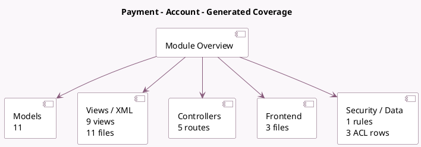

<!-- GENERATED:MODULE -->
---
tags: [odoo, community, module]
---

# Payment - Account

- Scope: Community Addons
- Source: odoo/addons/account_payment
- Dependencies: [[docs/Community Addons/account/account|account]], [[docs/Community Addons/payment/payment|payment]]

## Summary

Enable customers to pay invoices on the portal and post payments when transactions are processed.

## Generated coverage

- Models: 11
- XML files with UI/data artifacts: 11
- Views: 9
- Actions: 1
- Menus: 4
- Rules (ir.rule): 1
- Access CSV entries: 3
- Controller units: 2
- Frontend asset files: 3

## Module map

## Detail notes

- Models: [[docs/Community Addons/account_payment/Models|Models]] (11)
- Views and XML: [[docs/Community Addons/account_payment/Views|Views]] (11 files)
- Controllers: [[docs/Community Addons/account_payment/Controllers|Controllers]] (2)
- Frontend: [[docs/Community Addons/account_payment/Frontend|Frontend]] (3 files)

## Key models

- `account.journal`
- `account.move`
- `account.payment`
- `account.payment.method`
- `account.payment.method.line`
- `account.payment.register`
- `payment.link.wizard`
- `payment.provider`
- `payment.refund.wizard`
- `payment.transaction`
- `res.config.settings`

## Navigation

- [[../Community Addons/Community Addons|Back to scope]]
- [[../../docs/docs|Back to docs]]

<!-- GENERATED:MODULE -->

