<!-- GENERATED:MODEL -->
---
tags: [odoo, community, generated, model]
---

# peppol.config.wizard

- Module: [[docs/Community Addons/account_peppol/account_peppol|account_peppol]]
- Scope: Community Addons
- Defined in module: yes
- Source files: `wizard/peppol_config_wizard.py`
- Python classes: `PeppolConfigWizard`
- Description: Peppol Configuration Wizard

## Field footprint

- Detected fields: 11
- Field types: `Boolean` x 1, `Char` x 3, `Html` x 1, `Json` x 1, `Many2one` x 3, `One2many` x 1, `Selection` x 1
- Relation fields: 4

## Sample fields

- `account_peppol_contact_email`: `Char`
- `account_peppol_edi_identification`: `Char` (related `account_peppol_edi_user.edi_identification`)
- `account_peppol_edi_user`: `Many2one` (related `company_id.account_peppol_edi_user`)
- `account_peppol_migration_key`: `Char` (related `company_id.account_peppol_migration_key`)
- `account_peppol_proxy_state`: `Selection` (related `company_id.account_peppol_proxy_state`)
- `company_id`: `Many2one` (comodel `res.company`)
- `peppol_activate_self_billing`: `Boolean` (compute `_compute_peppol_activate_self_billing`)
- `peppol_self_billing_reception_journal_id`: `Many2one` (related `company_id.peppol_self_billing_reception_journal_id`)
- `service_ids`: `One2many` (comodel `account_peppol.service`, compute `_compute_service_ids`, store `True`)
- `service_info`: `Html` (compute `_compute_service_info`)
- `service_json`: `Json` (compute `_compute_service_json`, store `True`)

## Method hints

- Detected methods: 7
- Action methods: none
- Compute methods: `_compute_peppol_activate_self_billing`, `_compute_service_ids`, `_compute_service_info`, `_compute_service_json`
- Onchange methods: `_inverse_peppol_activate_self_billing`

## Direct relation diagram

```plantuml
@startuml
!define ODOO_COLOR_PRIMARY #714B67
!define ODOO_COLOR_ACCENT #875A7B
!define ODOO_COLOR_BG #FAF7FA

skinparam backgroundColor ODOO_COLOR_BG
skinparam defaultTextAlignment left
skinparam ArrowColor ODOO_COLOR_ACCENT
skinparam ClassBackgroundColor white
skinparam ClassBorderColor ODOO_COLOR_PRIMARY
skinparam ComponentBackgroundColor white
skinparam ComponentBorderColor ODOO_COLOR_PRIMARY
skinparam NoteBackgroundColor #FFF8FF
skinparam NoteBorderColor ODOO_COLOR_ACCENT
skinparam SequenceLifeLineBorderColor ODOO_COLOR_ACCENT
skinparam SequenceLifeLineBackgroundColor #FFFFFF
skinparam SequenceParticipantBorderColor ODOO_COLOR_PRIMARY
skinparam SequenceParticipantBackgroundColor #FFFFFF
skinparam sequence {
  ArrowColor ODOO_COLOR_ACCENT
  ActorBorderColor ODOO_COLOR_PRIMARY
}
title peppol.config.wizard - Direct Relations
class "peppol.config.wizard" as peppol_config_wizard
class "account_peppol.service" as account_peppol_service
class "res.company" as res_company
peppol_config_wizard --> res_company : company_id
peppol_config_wizard --|> account_peppol_service : service_ids
@enduml
```

## Navigation

- **Parent:** [[docs/Community Addons/account_peppol/Models]]

<!-- GENERATED:MODEL -->
