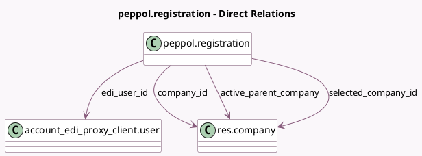

<!-- GENERATED:MODEL -->
---
tags: [odoo, community, generated, model]
---

# peppol.registration

- Module: [[docs/Community Addons/account_peppol/account_peppol|account_peppol]]
- Scope: Community Addons
- Defined in module: yes
- Source files: `wizard/peppol_registration.py`
- Python classes: `PeppolRegistration`
- Description: Peppol Registration

## Field footprint

- Detected fields: 18
- Field types: `Boolean` x 4, `Char` x 5, `Json` x 1, `Many2one` x 4, `Selection` x 4
- Relation fields: 4

## Sample fields

- `account_peppol_proxy_state`: `Selection` (related `selected_company_id.account_peppol_proxy_state`)
- `active_parent_company`: `Many2one` (comodel `res.company`, compute `_compute_from_company_id`)
- `active_parent_company_name`: `Char` (related `active_parent_company.name`)
- `can_use_parent_connection`: `Boolean` (compute `_compute_from_company_id`)
- `company_id`: `Many2one` (comodel `res.company`)
- `contact_email`: `Char` (related `selected_company_id.account_peppol_contact_email`)
- `edi_mode`: `Selection` (compute `_compute_edi_mode`)
- `edi_user_id`: `Many2one` (comodel `account_edi_proxy_client.user`, compute `_compute_edi_user_id`)
- `is_branch_company`: `Boolean` (compute `_compute_from_company_id`)
- `peppol_eas`: `Selection` (related `selected_company_id.peppol_eas`)
- `peppol_endpoint`: `Char` (related `selected_company_id.peppol_endpoint`)
- `peppol_external_provider`: `Char` (compute `_compute_smp_registration_external_provider`)
- `peppol_warnings`: `Json` (compute `_compute_peppol_warnings`)
- `phone_number`: `Char` (related `selected_company_id.account_peppol_phone_number`)
- `selected_company_id`: `Many2one` (comodel `res.company`, compute `_compute_selected_company_id`)
- `smp_registration`: `Boolean` (compute `_compute_smp_registration_external_provider`)
- `use_parent_connection`: `Boolean` (compute `_compute_use_parent_connection`)
- `use_parent_connection_selection`: `Selection`

## Method hints

- Detected methods: 15
- Action methods: none
- Compute methods: `_compute_edi_mode`, `_compute_edi_user_id`, `_compute_from_company_id`, `_compute_peppol_warnings`, `_compute_selected_company_id`, `_compute_smp_registration_external_provider`, `_compute_use_parent_connection`
- Onchange methods: `_onchange_peppol_endpoint`, `_onchange_phone_number`

## Direct relation diagram

## Navigation

- **Parent:** [[docs/Community Addons/account_peppol/Models]]

<!-- GENERATED:MODEL -->
