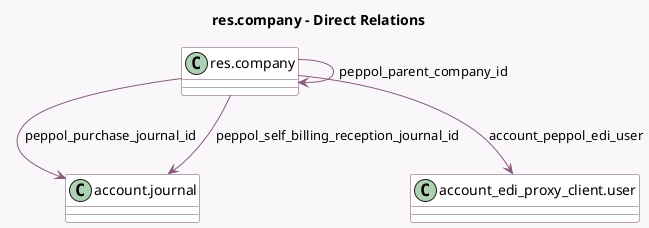

<!-- GENERATED:MODEL -->
---
tags: [odoo, community, generated, model]
---

# res.company

- Module: [[docs/Community Addons/account_peppol/account_peppol|account_peppol]]
- Scope: Community Addons
- Defined in module: extension only
- Source files: `models/res_company.py`
- Python classes: `ResCompany`

## Field footprint

- Detected fields: 15
- Field types: `Boolean` x 2, `Char` x 5, `Datetime` x 1, `Json` x 1, `Many2one` x 4, `Selection` x 2
- Relation fields: 4

## Sample fields

- `account_peppol_contact_email`: `Char` (compute `_compute_account_peppol_contact_email`, store `True`)
- `account_peppol_edi_user`: `Many2one` (comodel `account_edi_proxy_client.user`, compute `_compute_account_peppol_edi_user`)
- `account_peppol_migration_key`: `Char`
- `account_peppol_phone_number`: `Char` (compute `_compute_account_peppol_phone_number`, store `True`)
- `account_peppol_proxy_state`: `Selection`
- `peppol_activate_self_billing_sending`: `Boolean`
- `peppol_can_send`: `Boolean` (compute `_compute_peppol_can_send`)
- `peppol_eas`: `Selection` (related `partner_id.peppol_eas`)
- `peppol_endpoint`: `Char` (related `partner_id.peppol_endpoint`)
- `peppol_external_provider`: `Char`
- `peppol_metadata`: `Json`
- `peppol_metadata_updated_at`: `Datetime`
- `peppol_parent_company_id`: `Many2one` (comodel `res.company`, compute `_compute_peppol_parent_company_id`)
- `peppol_purchase_journal_id`: `Many2one` (comodel `account.journal`, compute `_compute_peppol_purchase_journal_id`, store `True`)
- `peppol_self_billing_reception_journal_id`: `Many2one` (comodel `account.journal`, compute `_compute_peppol_self_billing_reception_journal_id`, store `True`)

## Method hints

- Detected methods: 27
- Action methods: none
- Compute methods: `_compute_account_peppol_contact_email`, `_compute_account_peppol_edi_user`, `_compute_account_peppol_phone_number`, `_compute_peppol_can_send`, `_compute_peppol_parent_company_id`, `_compute_peppol_purchase_journal_id`, `_compute_peppol_self_billing_reception_journal_id`
- Onchange methods: none

## Direct relation diagram

## Navigation

- **Parent:** [[docs/Community Addons/account_peppol/Models]]

<!-- GENERATED:MODEL -->
