<!-- GENERATED:MODEL -->
---
tags: [odoo, community, generated, model]
---

# res.config.settings

- Module: [[docs/Community Addons/account_peppol/account_peppol|account_peppol]]
- Scope: Community Addons
- Defined in module: extension only
- Source files: `models/res_config_settings.py`
- Python classes: `ResConfigSettings`

## Field footprint

- Detected fields: 14
- Field types: `Boolean` x 2, `Char` x 7, `Many2one` x 2, `Selection` x 3
- Relation fields: 2

## Sample fields

- `account_is_token_out_of_sync`: `Boolean` (related `account_peppol_edi_user.is_token_out_of_sync`)
- `account_peppol_contact_email`: `Char` (related `company_id.account_peppol_contact_email`)
- `account_peppol_eas`: `Selection` (related `company_id.peppol_eas`)
- `account_peppol_edi_identification`: `Char` (related `account_peppol_edi_user.edi_identification`)
- `account_peppol_edi_mode`: `Selection` (related `account_peppol_edi_user.edi_mode`)
- `account_peppol_edi_user`: `Many2one` (related `company_id.account_peppol_edi_user`)
- `account_peppol_endpoint`: `Char` (related `company_id.peppol_endpoint`)
- `account_peppol_migration_key`: `Char` (related `company_id.account_peppol_migration_key`)
- `account_peppol_phone_number`: `Char` (related `company_id.account_peppol_phone_number`)
- `account_peppol_proxy_state`: `Selection` (related `company_id.account_peppol_proxy_state`)
- `account_peppol_purchase_journal_id`: `Many2one` (related `company_id.peppol_purchase_journal_id`)
- `peppol_external_provider`: `Char` (related `company_id.peppol_external_provider`)
- `peppol_parent_company_name`: `Char` (related `company_id.peppol_parent_company_id.name`)
- `peppol_use_parent_company`: `Boolean` (compute `_compute_peppol_use_parent_company`)

## Method hints

- Detected methods: 7
- Action methods: `action_open_peppol_form`
- Compute methods: `_compute_peppol_use_parent_company`
- Onchange methods: none

## Direct relation diagram

```plantuml
@startuml
!define ODOO_COLOR_PRIMARY #714B67
!define ODOO_COLOR_ACCENT #875A7B
!define ODOO_COLOR_BG #FAF7FA

skinparam backgroundColor ODOO_COLOR_BG
skinparam defaultTextAlignment left
skinparam ArrowColor ODOO_COLOR_ACCENT
skinparam ClassBackgroundColor white
skinparam ClassBorderColor ODOO_COLOR_PRIMARY
skinparam ComponentBackgroundColor white
skinparam ComponentBorderColor ODOO_COLOR_PRIMARY
skinparam NoteBackgroundColor #FFF8FF
skinparam NoteBorderColor ODOO_COLOR_ACCENT
skinparam SequenceLifeLineBorderColor ODOO_COLOR_ACCENT
skinparam SequenceLifeLineBackgroundColor #FFFFFF
skinparam SequenceParticipantBorderColor ODOO_COLOR_PRIMARY
skinparam SequenceParticipantBackgroundColor #FFFFFF
skinparam sequence {
  ArrowColor ODOO_COLOR_ACCENT
  ActorBorderColor ODOO_COLOR_PRIMARY
}
title res.config.settings - Direct Relations
class "res.config.settings" as res_config_settings
@enduml
```

## Navigation

- **Parent:** [[docs/Community Addons/account_peppol/Models]]

<!-- GENERATED:MODEL -->
