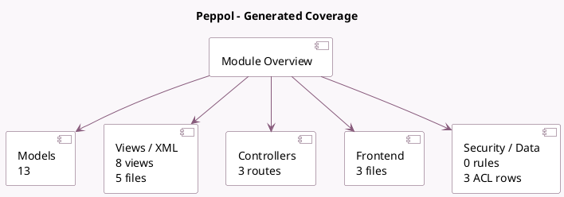

<!-- GENERATED:MODULE -->
---
tags: [odoo, community, module]
---

# Peppol

- Scope: Community Addons
- Source: odoo/addons/account_peppol
- Dependencies: [[docs/Community Addons/account_edi_proxy_client/account_edi_proxy_client|account_edi_proxy_client]], [[docs/Community Addons/account_edi_ubl_cii/account_edi_ubl_cii|account_edi_ubl_cii]]

## Summary

This module is used to send/receive documents with PEPPOL

## Generated coverage

- Models: 13
- XML files with UI/data artifacts: 5
- Views: 8
- Actions: 1
- Menus: 0
- Rules (ir.rule): 0
- Access CSV entries: 3
- Controller units: 1
- Frontend asset files: 3

## Module map

## Detail notes

- Models: [[docs/Community Addons/account_peppol/Models|Models]] (13)
- Views and XML: [[docs/Community Addons/account_peppol/Views|Views]] (5 files)
- Controllers: [[docs/Community Addons/account_peppol/Controllers|Controllers]] (1)
- Frontend: [[docs/Community Addons/account_peppol/Frontend|Frontend]] (3 files)

## Key models

- `account.edi.xml.ubl_20`
- `account.journal`
- `account.move`
- `account.move.send`
- `account.move.send.batch.wizard`
- `account.move.send.wizard`
- `account_edi_proxy_client.user`
- `account_peppol.service`
- `peppol.config.wizard`
- `peppol.registration`
- `res.company`
- `res.config.settings`

## Navigation

- [[../Community Addons/Community Addons|Back to scope]]
- [[../../docs/docs|Back to docs]]

<!-- GENERATED:MODULE -->

