<!-- GENERATED:MODEL -->
---
tags: [odoo, community, generated, model]
---

# account.update.tax.tags.wizard

- Module: [[docs/Community Addons/account_update_tax_tags/account_update_tax_tags|account_update_tax_tags]]
- Scope: Community Addons
- Defined in module: yes
- Source files: `wizard/account_update_tax_tags_wizard.py`
- Python classes: `AccountUpdateTaxTagsWizard`
- Description: Update Tax Tags Wizard

## Field footprint

- Detected fields: 3
- Field types: `Boolean` x 1, `Date` x 1, `Many2one` x 1
- Relation fields: 1

## Sample fields

- `company_id`: `Many2one` (comodel `res.company`)
- `date_from`: `Date` (compute `_compute_date_from`, store `True`)
- `display_lock_date_warning`: `Boolean` (compute `_compute_display_lock_date_warning`)

## Method hints

- Detected methods: 4
- Action methods: none
- Compute methods: `_compute_date_from`, `_compute_display_lock_date_warning`
- Onchange methods: none

## Direct relation diagram

```plantuml
@startuml
!define ODOO_COLOR_PRIMARY #714B67
!define ODOO_COLOR_ACCENT #875A7B
!define ODOO_COLOR_BG #FAF7FA

skinparam backgroundColor ODOO_COLOR_BG
skinparam defaultTextAlignment left
skinparam ArrowColor ODOO_COLOR_ACCENT
skinparam ClassBackgroundColor white
skinparam ClassBorderColor ODOO_COLOR_PRIMARY
skinparam ComponentBackgroundColor white
skinparam ComponentBorderColor ODOO_COLOR_PRIMARY
skinparam NoteBackgroundColor #FFF8FF
skinparam NoteBorderColor ODOO_COLOR_ACCENT
skinparam SequenceLifeLineBorderColor ODOO_COLOR_ACCENT
skinparam SequenceLifeLineBackgroundColor #FFFFFF
skinparam SequenceParticipantBorderColor ODOO_COLOR_PRIMARY
skinparam SequenceParticipantBackgroundColor #FFFFFF
skinparam sequence {
  ArrowColor ODOO_COLOR_ACCENT
  ActorBorderColor ODOO_COLOR_PRIMARY
}
title account.update.tax.tags.wizard - Direct Relations
class "account.update.tax.tags.wizard" as account_update_tax_tags_wizard
class "res.company" as res_company
account_update_tax_tags_wizard --> res_company : company_id
@enduml
```

## Navigation

- **Parent:** [[docs/Community Addons/account_update_tax_tags/Models]]

<!-- GENERATED:MODEL -->
