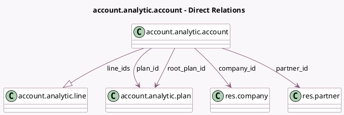

<!-- GENERATED:MODEL -->
---
tags: [odoo, community, generated, model]
---

# account.analytic.account

- Module: [[docs/Community Addons/analytic/analytic|analytic]]
- Scope: Community Addons
- Defined in module: yes
- Source files: `models/analytic_account.py`
- Python classes: `AccountAnalyticAccount`
- Description: Analytic Account
- Inherits: `mail.thread`

## Field footprint

- Detected fields: 13
- Field types: `Boolean` x 1, `Char` x 2, `Integer` x 1, `Many2one` x 5, `Monetary` x 3, `One2many` x 1
- Relation fields: 6

## Sample fields

- `active`: `Boolean` (comodel `Active`)
- `balance`: `Monetary` (compute `_compute_debit_credit_balance`)
- `code`: `Char`
- `color`: `Integer` (comodel `Color Index`, related `plan_id.color`)
- `company_id`: `Many2one` (comodel `res.company`)
- `credit`: `Monetary` (compute `_compute_debit_credit_balance`)
- `currency_id`: `Many2one` (related `company_id.currency_id`)
- `debit`: `Monetary` (compute `_compute_debit_credit_balance`)
- `line_ids`: `One2many` (comodel `account.analytic.line`)
- `name`: `Char`
- `partner_id`: `Many2one` (comodel `res.partner`)
- `plan_id`: `Many2one` (comodel `account.analytic.plan`)
- `root_plan_id`: `Many2one` (comodel `account.analytic.plan`, related `plan_id.root_id`, store `True`)

## Method hints

- Detected methods: 9
- Action methods: none
- Compute methods: `_compute_debit_credit_balance`, `_compute_display_name`
- Onchange methods: none

## Direct relation diagram

## Navigation

- **Parent:** [[docs/Community Addons/analytic/Models]]

<!-- GENERATED:MODEL -->
