<!-- GENERATED:MODEL -->
---
tags: [odoo, community, generated, model]
---

# account.analytic.distribution.model

- Module: [[docs/Community Addons/analytic/analytic|analytic]]
- Scope: Community Addons
- Defined in module: yes
- Source files: `models/analytic_distribution_model.py`
- Python classes: `AccountAnalyticDistributionModel`
- Description: Analytic Distribution Model
- Inherits: `analytic.mixin`

## Field footprint

- Detected fields: 4
- Field types: `Integer` x 1, `Many2one` x 3
- Relation fields: 3

## Sample fields

- `company_id`: `Many2one` (comodel `res.company`)
- `partner_category_id`: `Many2one` (comodel `res.partner.category`)
- `partner_id`: `Many2one` (comodel `res.partner`)
- `sequence`: `Integer`

## Method hints

- Detected methods: 5
- Action methods: none
- Compute methods: none
- Onchange methods: none

## Direct relation diagram

```plantuml
@startuml
!define ODOO_COLOR_PRIMARY #714B67
!define ODOO_COLOR_ACCENT #875A7B
!define ODOO_COLOR_BG #FAF7FA

skinparam backgroundColor ODOO_COLOR_BG
skinparam defaultTextAlignment left
skinparam ArrowColor ODOO_COLOR_ACCENT
skinparam ClassBackgroundColor white
skinparam ClassBorderColor ODOO_COLOR_PRIMARY
skinparam ComponentBackgroundColor white
skinparam ComponentBorderColor ODOO_COLOR_PRIMARY
skinparam NoteBackgroundColor #FFF8FF
skinparam NoteBorderColor ODOO_COLOR_ACCENT
skinparam SequenceLifeLineBorderColor ODOO_COLOR_ACCENT
skinparam SequenceLifeLineBackgroundColor #FFFFFF
skinparam SequenceParticipantBorderColor ODOO_COLOR_PRIMARY
skinparam SequenceParticipantBackgroundColor #FFFFFF
skinparam sequence {
  ArrowColor ODOO_COLOR_ACCENT
  ActorBorderColor ODOO_COLOR_PRIMARY
}
title account.analytic.distribution.model - Direct Relations
class "account.analytic.distribution.model" as account_analytic_distribution_model
class "res.company" as res_company
class "res.partner" as res_partner
class "res.partner.category" as res_partner_category
account_analytic_distribution_model --> res_partner : partner_id
account_analytic_distribution_model --> res_partner_category : partner_category_id
account_analytic_distribution_model --> res_company : company_id
@enduml
```

## Navigation

- **Parent:** [[docs/Community Addons/analytic/Models]]

<!-- GENERATED:MODEL -->
