<!-- GENERATED:MODEL -->
---
tags: [odoo, community, generated, model]
---

# account.analytic.line

- Module: [[docs/Community Addons/analytic/analytic|analytic]]
- Scope: Community Addons
- Defined in module: yes
- Source files: `models/analytic_line.py`
- Python classes: `AccountAnalyticLine`
- Description: Analytic Line
- Inherits: `analytic.plan.fields.mixin`

## Field footprint

- Detected fields: 13
- Field types: `Boolean` x 1, `Char` x 1, `Date` x 1, `Float` x 1, `Integer` x 1, `Json` x 1, `Many2one` x 5, `Monetary` x 1, `Selection` x 1
- Relation fields: 5

## Sample fields

- `amount`: `Monetary` (comodel `Amount`)
- `analytic_distribution`: `Json` (comodel `Analytic Distribution`, compute `_compute_analytic_distribution`)
- `analytic_precision`: `Integer` (store `False`)
- `category`: `Selection`
- `company_id`: `Many2one` (comodel `res.company`)
- `currency_id`: `Many2one` (related `company_id.currency_id`, store `True`)
- `date`: `Date` (comodel `Date`)
- `fiscal_year_search`: `Boolean` (store `False`)
- `name`: `Char` (comodel `Description`)
- `partner_id`: `Many2one` (comodel `res.partner`)
- `product_uom_id`: `Many2one` (comodel `uom.uom`)
- `unit_amount`: `Float` (comodel `Quantity`)
- `user_id`: `Many2one` (comodel `res.users`)

## Method hints

- Detected methods: 4
- Action methods: none
- Compute methods: `_compute_analytic_distribution`
- Onchange methods: none

## Direct relation diagram

```plantuml
@startuml
!define ODOO_COLOR_PRIMARY #714B67
!define ODOO_COLOR_ACCENT #875A7B
!define ODOO_COLOR_BG #FAF7FA

skinparam backgroundColor ODOO_COLOR_BG
skinparam defaultTextAlignment left
skinparam ArrowColor ODOO_COLOR_ACCENT
skinparam ClassBackgroundColor white
skinparam ClassBorderColor ODOO_COLOR_PRIMARY
skinparam ComponentBackgroundColor white
skinparam ComponentBorderColor ODOO_COLOR_PRIMARY
skinparam NoteBackgroundColor #FFF8FF
skinparam NoteBorderColor ODOO_COLOR_ACCENT
skinparam SequenceLifeLineBorderColor ODOO_COLOR_ACCENT
skinparam SequenceLifeLineBackgroundColor #FFFFFF
skinparam SequenceParticipantBorderColor ODOO_COLOR_PRIMARY
skinparam SequenceParticipantBackgroundColor #FFFFFF
skinparam sequence {
  ArrowColor ODOO_COLOR_ACCENT
  ActorBorderColor ODOO_COLOR_PRIMARY
}
title account.analytic.line - Direct Relations
class "account.analytic.line" as account_analytic_line
class "res.company" as res_company
class "res.partner" as res_partner
class "res.users" as res_users
class "uom.uom" as uom_uom
account_analytic_line --> uom_uom : product_uom_id
account_analytic_line --> res_partner : partner_id
account_analytic_line --> res_users : user_id
account_analytic_line --> res_company : company_id
@enduml
```

## Navigation

- **Parent:** [[docs/Community Addons/analytic/Models]]

<!-- GENERATED:MODEL -->
