<!-- GENERATED:MODEL -->
---
tags: [odoo, community, generated, model]
---

# account.analytic.plan

- Module: [[docs/Community Addons/analytic/analytic|analytic]]
- Scope: Community Addons
- Defined in module: yes
- Source files: `models/analytic_plan.py`
- Python classes: `AccountAnalyticPlan`
- Description: Analytic Plans

## Field footprint

- Detected fields: 15
- Field types: `Char` x 3, `Integer` x 5, `Many2one` x 2, `One2many` x 3, `Selection` x 1, `Text` x 1
- Relation fields: 5

## Sample fields

- `account_count`: `Integer` (comodel `Analytic Accounts Count`, compute `_compute_analytic_account_count`)
- `account_ids`: `One2many` (comodel `account.analytic.account`)
- `all_account_count`: `Integer` (comodel `All Analytic Accounts Count`, compute `_compute_all_analytic_account_count`)
- `applicability_ids`: `One2many` (comodel `account.analytic.applicability`)
- `children_count`: `Integer` (comodel `Children Plans Count`, compute `_compute_children_count`)
- `children_ids`: `One2many` (comodel `account.analytic.plan`)
- `color`: `Integer` (comodel `Color`)
- `complete_name`: `Char` (comodel `Complete Name`, compute `_compute_complete_name`, store `True`)
- `default_applicability`: `Selection`
- `description`: `Text`
- `name`: `Char`
- `parent_id`: `Many2one` (comodel `account.analytic.plan`)
- `parent_path`: `Char`
- `root_id`: `Many2one` (comodel `account.analytic.plan`, compute `_compute_root_id`)
- `sequence`: `Integer`

## Method hints

- Detected methods: 27
- Action methods: `action_view_analytical_accounts`, `action_view_children_plans`
- Compute methods: `_compute_all_analytic_account_count`, `_compute_analytic_account_count`, `_compute_children_count`, `_compute_complete_name`, `_compute_root_id`
- Onchange methods: `_onchange_parent_id`

## Direct relation diagram

```plantuml
@startuml
!define ODOO_COLOR_PRIMARY #714B67
!define ODOO_COLOR_ACCENT #875A7B
!define ODOO_COLOR_BG #FAF7FA

skinparam backgroundColor ODOO_COLOR_BG
skinparam defaultTextAlignment left
skinparam ArrowColor ODOO_COLOR_ACCENT
skinparam ClassBackgroundColor white
skinparam ClassBorderColor ODOO_COLOR_PRIMARY
skinparam ComponentBackgroundColor white
skinparam ComponentBorderColor ODOO_COLOR_PRIMARY
skinparam NoteBackgroundColor #FFF8FF
skinparam NoteBorderColor ODOO_COLOR_ACCENT
skinparam SequenceLifeLineBorderColor ODOO_COLOR_ACCENT
skinparam SequenceLifeLineBackgroundColor #FFFFFF
skinparam SequenceParticipantBorderColor ODOO_COLOR_PRIMARY
skinparam SequenceParticipantBackgroundColor #FFFFFF
skinparam sequence {
  ArrowColor ODOO_COLOR_ACCENT
  ActorBorderColor ODOO_COLOR_PRIMARY
}
title account.analytic.plan - Direct Relations
class "account.analytic.plan" as account_analytic_plan
class "account.analytic.account" as account_analytic_account
class "account.analytic.applicability" as account_analytic_applicability
class "account.analytic.plan" as account_analytic_plan
account_analytic_plan --> account_analytic_plan : parent_id
account_analytic_plan --> account_analytic_plan : root_id
account_analytic_plan --|> account_analytic_plan : children_ids
account_analytic_plan --|> account_analytic_account : account_ids
account_analytic_plan --|> account_analytic_applicability : applicability_ids
@enduml
```

## Navigation

- **Parent:** [[docs/Community Addons/analytic/Models]]

<!-- GENERATED:MODEL -->
