<!-- GENERATED:MODEL -->
---
tags: [odoo, community, generated, model]
---

# analytic.mixin

- Module: [[docs/Community Addons/analytic/analytic|analytic]]
- Scope: Community Addons
- Defined in module: yes
- Source files: `models/analytic_mixin.py`
- Python classes: `AnalyticMixin`
- Description: Analytic Mixin

## Field footprint

- Detected fields: 3
- Field types: `Integer` x 1, `Json` x 1, `Many2many` x 1
- Relation fields: 1

## Sample fields

- `analytic_distribution`: `Json` (comodel `Analytic Distribution`, compute `_compute_analytic_distribution`, store `True`)
- `analytic_precision`: `Integer` (store `False`)
- `distribution_analytic_account_ids`: `Many2many` (comodel `account.analytic.account`, compute `_compute_distribution_analytic_account_ids`)

## Method hints

- Detected methods: 16
- Action methods: none
- Compute methods: `_compute_analytic_distribution`, `_compute_distribution_analytic_account_ids`
- Onchange methods: none

## Direct relation diagram

```plantuml
@startuml
!define ODOO_COLOR_PRIMARY #714B67
!define ODOO_COLOR_ACCENT #875A7B
!define ODOO_COLOR_BG #FAF7FA

skinparam backgroundColor ODOO_COLOR_BG
skinparam defaultTextAlignment left
skinparam ArrowColor ODOO_COLOR_ACCENT
skinparam ClassBackgroundColor white
skinparam ClassBorderColor ODOO_COLOR_PRIMARY
skinparam ComponentBackgroundColor white
skinparam ComponentBorderColor ODOO_COLOR_PRIMARY
skinparam NoteBackgroundColor #FFF8FF
skinparam NoteBorderColor ODOO_COLOR_ACCENT
skinparam SequenceLifeLineBorderColor ODOO_COLOR_ACCENT
skinparam SequenceLifeLineBackgroundColor #FFFFFF
skinparam SequenceParticipantBorderColor ODOO_COLOR_PRIMARY
skinparam SequenceParticipantBackgroundColor #FFFFFF
skinparam sequence {
  ArrowColor ODOO_COLOR_ACCENT
  ActorBorderColor ODOO_COLOR_PRIMARY
}
title analytic.mixin - Direct Relations
class "analytic.mixin" as analytic_mixin
class "account.analytic.account" as account_analytic_account
analytic_mixin .. account_analytic_account : distribution_analytic_account_ids
@enduml
```

## Navigation

- **Parent:** [[docs/Community Addons/analytic/Models]]

<!-- GENERATED:MODEL -->
