<!-- GENERATED:MODEL -->
---
tags: [odoo, community, generated, model]
---

# analytic.plan.fields.mixin

- Module: [[docs/Community Addons/analytic/analytic|analytic]]
- Scope: Community Addons
- Defined in module: yes
- Source files: `models/analytic_line.py`
- Python classes: `AnalyticPlanFieldsMixin`
- Description: Analytic Plan Fields

## Field footprint

- Detected fields: 2
- Field types: `Many2one` x 2
- Relation fields: 2

## Sample fields

- `account_id`: `Many2one` (comodel `account.analytic.account`)
- `auto_account_id`: `Many2one` (comodel `account.analytic.account`, compute `_compute_auto_account`)

## Method hints

- Detected methods: 15
- Action methods: none
- Compute methods: `_compute_auto_account`, `_compute_partner_id`
- Onchange methods: none

## Direct relation diagram

```plantuml
@startuml
!define ODOO_COLOR_PRIMARY #714B67
!define ODOO_COLOR_ACCENT #875A7B
!define ODOO_COLOR_BG #FAF7FA

skinparam backgroundColor ODOO_COLOR_BG
skinparam defaultTextAlignment left
skinparam ArrowColor ODOO_COLOR_ACCENT
skinparam ClassBackgroundColor white
skinparam ClassBorderColor ODOO_COLOR_PRIMARY
skinparam ComponentBackgroundColor white
skinparam ComponentBorderColor ODOO_COLOR_PRIMARY
skinparam NoteBackgroundColor #FFF8FF
skinparam NoteBorderColor ODOO_COLOR_ACCENT
skinparam SequenceLifeLineBorderColor ODOO_COLOR_ACCENT
skinparam SequenceLifeLineBackgroundColor #FFFFFF
skinparam SequenceParticipantBorderColor ODOO_COLOR_PRIMARY
skinparam SequenceParticipantBackgroundColor #FFFFFF
skinparam sequence {
  ArrowColor ODOO_COLOR_ACCENT
  ActorBorderColor ODOO_COLOR_PRIMARY
}
title analytic.plan.fields.mixin - Direct Relations
class "analytic.plan.fields.mixin" as analytic_plan_fields_mixin
class "account.analytic.account" as account_analytic_account
analytic_plan_fields_mixin --> account_analytic_account : account_id
analytic_plan_fields_mixin --> account_analytic_account : auto_account_id
@enduml
```

## Navigation

- **Parent:** [[docs/Community Addons/analytic/Models]]

<!-- GENERATED:MODEL -->
