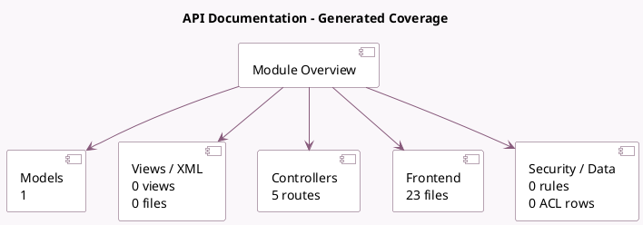

<!-- GENERATED:MODULE -->
---
tags: [odoo, community, module]
---

# API Documentation

- Scope: Community Addons
- Source: odoo/addons/api_doc
- Dependencies: [[docs/Community Addons/web/web|web]]

## Generated coverage

- Models: 1
- XML files with UI/data artifacts: 0
- Views: 0
- Actions: 0
- Menus: 0
- Rules (ir.rule): 0
- Access CSV entries: 0
- Controller units: 1
- Frontend asset files: 23

## Module map

## Detail notes

- Models: [[docs/Community Addons/api_doc/Models|Models]] (1)
- Controllers: [[docs/Community Addons/api_doc/Controllers|Controllers]] (1)
- Frontend: [[docs/Community Addons/api_doc/Frontend|Frontend]] (23 files)

## Key models

- `ir.attachment`

## Navigation

- [[../Community Addons/Community Addons|Back to scope]]
- [[../../docs/docs|Back to docs]]

<!-- GENERATED:MODULE -->

## Curated analysis

### Functional role
- `api_doc` exposes a live documentation surface for installed models, fields, and public methods.
- It is closer to a registry introspection tool than to a static API guide: the output depends on the current database, installed modules, language, and user permissions.

### Access model
- The HTML client at `/doc` and the JSON endpoints under `/doc/*.json` require membership in `api_doc.group_allow_doc`.
- Odoo 19 also exposes bearer-token variants under `/doc-bearer/...`, which makes the module usable without a browser session when an API key is appropriate.

### What the module returns
- `/doc/index.json` returns installed modules plus a catalog of readable models, their fields, and public methods.
- `/doc/<model>.json` expands one model with `fields_get()` metadata, parsed method signatures, docstrings converted to HTML, and inferred introducing module/model information.
- Deprecated methods are filtered out through `get_public_method`, so the output is intentionally narrower than `dir(Model)`.

### Runtime characteristics
- The index response uses ETags keyed by registry sequence, language, and user groups.
- Large index payloads are cached server-side as private attachments instead of only relying on in-memory cache.
- The quality of the exported method documentation depends directly on Python docstrings. Clean RST docstrings produce better output; weak docstrings produce weak docs.

### Evidence
- Controller and docstring parsing pipeline: `odoo19/addons/api_doc/controllers/api_doc.py`
- Access and response tests: `odoo19/addons/api_doc/tests/test_doc.py`
- Manifest summary: `odoo19/addons/api_doc/__manifest__.py`

### Rollout guidance
- Restrict the technical documentation group to integration users and internal developers.
- Treat this module as generated reference material, then complement it with curated business or architectural notes where raw reflection is not enough.
