<!-- GENERATED:MODEL -->
---
tags: [odoo, community, generated, model]
---

# res.company.ldap

- Module: [[docs/Community Addons/auth_ldap/auth_ldap|auth_ldap]]
- Scope: Community Addons
- Defined in module: yes
- Source files: `models/res_company_ldap.py`
- Python classes: `ResCompanyLdap`
- Description: Company LDAP configuration

## Field footprint

- Detected fields: 11
- Field types: `Boolean` x 2, `Char` x 5, `Integer` x 2, `Many2one` x 2
- Relation fields: 2

## Sample fields

- `company`: `Many2one` (comodel `res.company`)
- `create_user`: `Boolean`
- `ldap_base`: `Char`
- `ldap_binddn`: `Char` (comodel `LDAP binddn`)
- `ldap_filter`: `Char`
- `ldap_password`: `Char`
- `ldap_server`: `Char`
- `ldap_server_port`: `Integer`
- `ldap_tls`: `Boolean`
- `sequence`: `Integer`
- `user`: `Many2one` (comodel `res.users`)

## Method hints

- Detected methods: 9
- Action methods: none
- Compute methods: none
- Onchange methods: none

## Direct relation diagram

```plantuml
@startuml
!define ODOO_COLOR_PRIMARY #714B67
!define ODOO_COLOR_ACCENT #875A7B
!define ODOO_COLOR_BG #FAF7FA

skinparam backgroundColor ODOO_COLOR_BG
skinparam defaultTextAlignment left
skinparam ArrowColor ODOO_COLOR_ACCENT
skinparam ClassBackgroundColor white
skinparam ClassBorderColor ODOO_COLOR_PRIMARY
skinparam ComponentBackgroundColor white
skinparam ComponentBorderColor ODOO_COLOR_PRIMARY
skinparam NoteBackgroundColor #FFF8FF
skinparam NoteBorderColor ODOO_COLOR_ACCENT
skinparam SequenceLifeLineBorderColor ODOO_COLOR_ACCENT
skinparam SequenceLifeLineBackgroundColor #FFFFFF
skinparam SequenceParticipantBorderColor ODOO_COLOR_PRIMARY
skinparam SequenceParticipantBackgroundColor #FFFFFF
skinparam sequence {
  ArrowColor ODOO_COLOR_ACCENT
  ActorBorderColor ODOO_COLOR_PRIMARY
}
title res.company.ldap - Direct Relations
class "res.company.ldap" as res_company_ldap
class "res.company" as res_company
class "res.users" as res_users
res_company_ldap --> res_company : company
res_company_ldap --> res_users : user
@enduml
```

## Navigation

- **Parent:** [[docs/Community Addons/auth_ldap/Models]]

<!-- GENERATED:MODEL -->
