<!-- GENERATED:MODEL -->
---
tags: [odoo, community, generated, model]
---

# auth.passkey.key

- Module: [[docs/Community Addons/auth_passkey/auth_passkey|auth_passkey]]
- Scope: Community Addons
- Defined in module: yes
- Source files: `models/auth_passkey_key.py`
- Python classes: `AuthPasskeyKey`
- Description: Passkey

## Field footprint

- Detected fields: 5
- Field types: `Char` x 3, `Integer` x 1, `Many2one` x 1
- Relation fields: 1

## Sample fields

- `create_uid`: `Many2one` (comodel `res.users`)
- `credential_identifier`: `Char`
- `name`: `Char`
- `public_key`: `Char` (compute `_compute_public_key`)
- `sign_count`: `Integer`

## Method hints

- Detected methods: 11
- Action methods: `action_delete_passkey`, `action_rename_passkey`
- Compute methods: `_compute_public_key`
- Onchange methods: none

## Direct relation diagram

```plantuml
@startuml
!define ODOO_COLOR_PRIMARY #714B67
!define ODOO_COLOR_ACCENT #875A7B
!define ODOO_COLOR_BG #FAF7FA

skinparam backgroundColor ODOO_COLOR_BG
skinparam defaultTextAlignment left
skinparam ArrowColor ODOO_COLOR_ACCENT
skinparam ClassBackgroundColor white
skinparam ClassBorderColor ODOO_COLOR_PRIMARY
skinparam ComponentBackgroundColor white
skinparam ComponentBorderColor ODOO_COLOR_PRIMARY
skinparam NoteBackgroundColor #FFF8FF
skinparam NoteBorderColor ODOO_COLOR_ACCENT
skinparam SequenceLifeLineBorderColor ODOO_COLOR_ACCENT
skinparam SequenceLifeLineBackgroundColor #FFFFFF
skinparam SequenceParticipantBorderColor ODOO_COLOR_PRIMARY
skinparam SequenceParticipantBackgroundColor #FFFFFF
skinparam sequence {
  ArrowColor ODOO_COLOR_ACCENT
  ActorBorderColor ODOO_COLOR_PRIMARY
}
title auth.passkey.key - Direct Relations
class "auth.passkey.key" as auth_passkey_key
class "res.users" as res_users
auth_passkey_key --> res_users : create_uid
@enduml
```

## Navigation

- **Parent:** [[docs/Community Addons/auth_passkey/Models]]

<!-- GENERATED:MODEL -->
