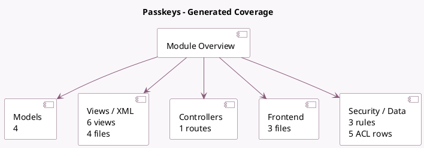

<!-- GENERATED:MODULE -->
---
tags: [odoo, community, module]
---

# Passkeys

- Scope: Community Addons
- Source: odoo/addons/auth_passkey
- Dependencies: [[docs/Community Addons/base_setup/base_setup|base_setup]], [[docs/Community Addons/web/web|web]]

## Summary

Log in with a Passkey

## Generated coverage

- Models: 4
- XML files with UI/data artifacts: 4
- Views: 6
- Actions: 1
- Menus: 0
- Rules (ir.rule): 3
- Access CSV entries: 5
- Controller units: 1
- Frontend asset files: 3

## Module map

## Detail notes

- Models: [[docs/Community Addons/auth_passkey/Models|Models]] (4)
- Views and XML: [[docs/Community Addons/auth_passkey/Views|Views]] (4 files)
- Controllers: [[docs/Community Addons/auth_passkey/Controllers|Controllers]] (1)
- Frontend: [[docs/Community Addons/auth_passkey/Frontend|Frontend]] (3 files)

## Key models

- `auth.passkey.key`
- `auth.passkey.key.create`
- `res.users`
- `res.users.identitycheck`

## Navigation

- [[../Community Addons/Community Addons|Back to scope]]
- [[../../docs/docs|Back to docs]]

<!-- GENERATED:MODULE -->

