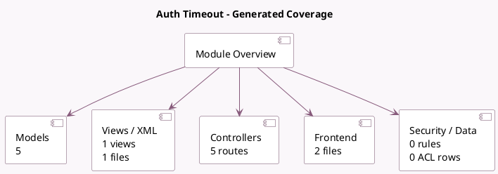

<!-- GENERATED:MODULE -->
---
tags: [odoo, community, module]
---

# Auth Timeout

- Scope: Community Addons
- Source: odoo/addons/auth_timeout
- Dependencies: [[docs/Community Addons/auth_totp/auth_totp|auth_totp]], [[docs/Community Addons/auth_totp_mail/auth_totp_mail|auth_totp_mail]], [[docs/Community Addons/auth_passkey/auth_passkey|auth_passkey]], [[docs/Community Addons/bus/bus|bus]]

## Summary

Ask for authentication after user inactivity

## Generated coverage

- Models: 5
- XML files with UI/data artifacts: 1
- Views: 1
- Actions: 0
- Menus: 0
- Rules (ir.rule): 0
- Access CSV entries: 0
- Controller units: 3
- Frontend asset files: 2

## Module map

## Detail notes

- Models: [[docs/Community Addons/auth_timeout/Models|Models]] (5)
- Views and XML: [[docs/Community Addons/auth_timeout/Views|Views]] (1 files)
- Controllers: [[docs/Community Addons/auth_timeout/Controllers|Controllers]] (3)
- Frontend: [[docs/Community Addons/auth_timeout/Frontend|Frontend]] (2 files)

## Key models

- `auth_totp.device`
- `ir.http`
- `ir.websocket`
- `res.groups`
- `res.users`

## Navigation

- [[../Community Addons/Community Addons|Back to scope]]
- [[../../docs/docs|Back to docs]]

<!-- GENERATED:MODULE -->

