<!-- GENERATED:MODEL -->
---
tags: [odoo, community, generated, model]
---

# auth_totp.wizard

- Module: [[docs/Community Addons/auth_totp/auth_totp|auth_totp]]
- Scope: Community Addons
- Defined in module: yes
- Source files: `wizard/auth_totp_wizard.py`
- Python classes: `Auth_TotpWizard`
- Description: 2-Factor Setup Wizard

## Field footprint

- Detected fields: 5
- Field types: `Binary` x 1, `Char` x 3, `Many2one` x 1
- Relation fields: 1

## Sample fields

- `code`: `Char` (store `False`)
- `qrcode`: `Binary` (compute `_compute_qrcode`, store `True`)
- `secret`: `Char`
- `url`: `Char` (compute `_compute_qrcode`, store `True`)
- `user_id`: `Many2one` (comodel `res.users`)

## Method hints

- Detected methods: 2
- Action methods: none
- Compute methods: `_compute_qrcode`
- Onchange methods: none

## Direct relation diagram

```plantuml
@startuml
!define ODOO_COLOR_PRIMARY #714B67
!define ODOO_COLOR_ACCENT #875A7B
!define ODOO_COLOR_BG #FAF7FA

skinparam backgroundColor ODOO_COLOR_BG
skinparam defaultTextAlignment left
skinparam ArrowColor ODOO_COLOR_ACCENT
skinparam ClassBackgroundColor white
skinparam ClassBorderColor ODOO_COLOR_PRIMARY
skinparam ComponentBackgroundColor white
skinparam ComponentBorderColor ODOO_COLOR_PRIMARY
skinparam NoteBackgroundColor #FFF8FF
skinparam NoteBorderColor ODOO_COLOR_ACCENT
skinparam SequenceLifeLineBorderColor ODOO_COLOR_ACCENT
skinparam SequenceLifeLineBackgroundColor #FFFFFF
skinparam SequenceParticipantBorderColor ODOO_COLOR_PRIMARY
skinparam SequenceParticipantBackgroundColor #FFFFFF
skinparam sequence {
  ArrowColor ODOO_COLOR_ACCENT
  ActorBorderColor ODOO_COLOR_PRIMARY
}
title auth_totp.wizard - Direct Relations
class "auth_totp.wizard" as auth_totp_wizard
class "res.users" as res_users
auth_totp_wizard --> res_users : user_id
@enduml
```

## Navigation

- **Parent:** [[docs/Community Addons/auth_totp/Models]]

<!-- GENERATED:MODEL -->
