<!-- GENERATED:MODEL -->
---
tags: [odoo, community, generated, model]
---

# res.users

- Module: [[docs/Community Addons/auth_totp/auth_totp|auth_totp]]
- Scope: Community Addons
- Defined in module: extension only
- Source files: `models/res_users.py`
- Python classes: `ResUsers`

## Field footprint

- Detected fields: 4
- Field types: `Boolean` x 1, `Char` x 1, `Integer` x 1, `One2many` x 1
- Relation fields: 1

## Sample fields

- `totp_enabled`: `Boolean` (compute `_compute_totp_enabled`)
- `totp_last_counter`: `Integer`
- `totp_secret`: `Char` (compute `_compute_totp_secret`)
- `totp_trusted_device_ids`: `One2many` (comodel `auth_totp.device`)

## Method hints

- Detected methods: 19
- Action methods: `action_totp_disable`, `action_totp_enable_wizard`
- Compute methods: `_compute_totp_enabled`, `_compute_totp_secret`
- Onchange methods: none

## Direct relation diagram

```plantuml
@startuml
!define ODOO_COLOR_PRIMARY #714B67
!define ODOO_COLOR_ACCENT #875A7B
!define ODOO_COLOR_BG #FAF7FA

skinparam backgroundColor ODOO_COLOR_BG
skinparam defaultTextAlignment left
skinparam ArrowColor ODOO_COLOR_ACCENT
skinparam ClassBackgroundColor white
skinparam ClassBorderColor ODOO_COLOR_PRIMARY
skinparam ComponentBackgroundColor white
skinparam ComponentBorderColor ODOO_COLOR_PRIMARY
skinparam NoteBackgroundColor #FFF8FF
skinparam NoteBorderColor ODOO_COLOR_ACCENT
skinparam SequenceLifeLineBorderColor ODOO_COLOR_ACCENT
skinparam SequenceLifeLineBackgroundColor #FFFFFF
skinparam SequenceParticipantBorderColor ODOO_COLOR_PRIMARY
skinparam SequenceParticipantBackgroundColor #FFFFFF
skinparam sequence {
  ArrowColor ODOO_COLOR_ACCENT
  ActorBorderColor ODOO_COLOR_PRIMARY
}
title res.users - Direct Relations
class "res.users" as res_users
class "auth_totp.device" as auth_totp_device
res_users --|> auth_totp_device : totp_trusted_device_ids
@enduml
```

## Navigation

- **Parent:** [[docs/Community Addons/auth_totp/Models]]

<!-- GENERATED:MODEL -->
