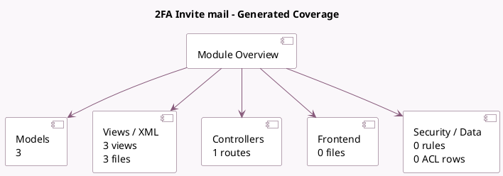

<!-- GENERATED:MODULE -->
---
tags: [odoo, community, module]
---

# 2FA Invite mail

- Scope: Community Addons
- Source: odoo/addons/auth_totp_mail
- Dependencies: [[docs/Community Addons/auth_totp/auth_totp|auth_totp]], [[docs/Community Addons/mail/mail|mail]]

## Generated coverage

- Models: 3
- XML files with UI/data artifacts: 3
- Views: 3
- Actions: 2
- Menus: 0
- Rules (ir.rule): 0
- Access CSV entries: 0
- Controller units: 1
- Frontend asset files: 0

## Module map

## Detail notes

- Models: [[docs/Community Addons/auth_totp_mail/Models|Models]] (3)
- Views and XML: [[docs/Community Addons/auth_totp_mail/Views|Views]] (3 files)
- Controllers: [[docs/Community Addons/auth_totp_mail/Controllers|Controllers]] (1)

## Key models

- `auth_totp.device`
- `res.config.settings`
- `res.users`

## Navigation

- [[../Community Addons/Community Addons|Back to scope]]
- [[../../docs/docs|Back to docs]]

<!-- GENERATED:MODULE -->

