<!-- GENERATED:MODEL -->
---
tags: [odoo, community, generated, model]
---

# barcode.rule

- Module: [[docs/Community Addons/barcodes/barcodes|barcodes]]
- Scope: Community Addons
- Defined in module: yes
- Source files: `models/barcode_rule.py`
- Python classes: `BarcodeRule`
- Description: Barcode Rule

## Field footprint

- Detected fields: 7
- Field types: `Char` x 3, `Integer` x 1, `Many2one` x 1, `Selection` x 2
- Relation fields: 1

## Sample fields

- `alias`: `Char`
- `barcode_nomenclature_id`: `Many2one` (comodel `barcode.nomenclature`)
- `encoding`: `Selection`
- `name`: `Char`
- `pattern`: `Char`
- `sequence`: `Integer`
- `type`: `Selection`

## Method hints

- Detected methods: 1
- Action methods: none
- Compute methods: none
- Onchange methods: none

## Direct relation diagram

```plantuml
@startuml
!define ODOO_COLOR_PRIMARY #714B67
!define ODOO_COLOR_ACCENT #875A7B
!define ODOO_COLOR_BG #FAF7FA

skinparam backgroundColor ODOO_COLOR_BG
skinparam defaultTextAlignment left
skinparam ArrowColor ODOO_COLOR_ACCENT
skinparam ClassBackgroundColor white
skinparam ClassBorderColor ODOO_COLOR_PRIMARY
skinparam ComponentBackgroundColor white
skinparam ComponentBorderColor ODOO_COLOR_PRIMARY
skinparam NoteBackgroundColor #FFF8FF
skinparam NoteBorderColor ODOO_COLOR_ACCENT
skinparam SequenceLifeLineBorderColor ODOO_COLOR_ACCENT
skinparam SequenceLifeLineBackgroundColor #FFFFFF
skinparam SequenceParticipantBorderColor ODOO_COLOR_PRIMARY
skinparam SequenceParticipantBackgroundColor #FFFFFF
skinparam sequence {
  ArrowColor ODOO_COLOR_ACCENT
  ActorBorderColor ODOO_COLOR_PRIMARY
}
title barcode.rule - Direct Relations
class "barcode.rule" as barcode_rule
class "barcode.nomenclature" as barcode_nomenclature
barcode_rule --> barcode_nomenclature : barcode_nomenclature_id
@enduml
```

## Navigation

- **Parent:** [[docs/Community Addons/barcodes/Models]]

<!-- GENERATED:MODEL -->
