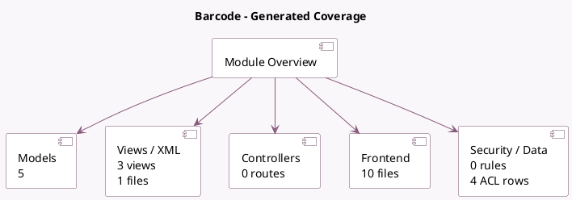

<!-- GENERATED:MODULE -->
---
tags: [odoo, community, module]
---

# Barcode

- Scope: Community Addons
- Source: odoo/addons/barcodes
- Dependencies: [[docs/Community Addons/web/web|web]]

## Summary

Scan and Parse Barcodes

## Generated coverage

- Models: 5
- XML files with UI/data artifacts: 1
- Views: 3
- Actions: 1
- Menus: 0
- Rules (ir.rule): 0
- Access CSV entries: 4
- Controller units: 0
- Frontend asset files: 10

## Module map

## Detail notes

- Models: [[docs/Community Addons/barcodes/Models|Models]] (5)
- Views and XML: [[docs/Community Addons/barcodes/Views|Views]] (1 files)
- Frontend: [[docs/Community Addons/barcodes/Frontend|Frontend]] (10 files)

## Key models

- `barcode.nomenclature`
- `barcode.rule`
- `barcodes.barcode_events_mixin`
- `ir.http`
- `res.company`

## Navigation

- [[../Community Addons/Community Addons|Back to scope]]
- [[../../docs/docs|Back to docs]]

<!-- GENERATED:MODULE -->

